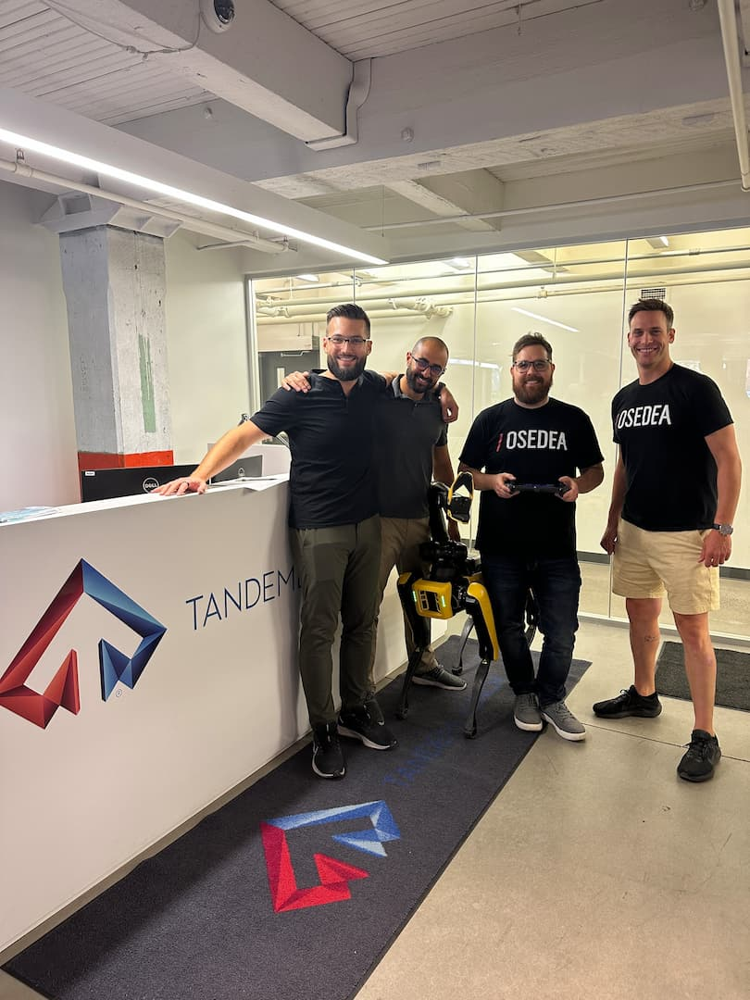

This talk explores innovations in AI and robotics for unstructured real-world environments. It will cover closed-loop data applications, humanoid and service robots for labour, inspection use cases with Boston Dynamics Spot, and the coming wave of intelligent systems built to interact collaboratively in human spaces. The discussion will provide an insider perspective on the progress, pitfalls and potential as autonomy moves beyond controlled settings and into the chaos of the human world.

Dr. Nicholas Nadeau, a dynamic CTO and seasoned engineer, brings deep expertise in AI/ML, robotics, 3D printing, and other emerging technologies.

