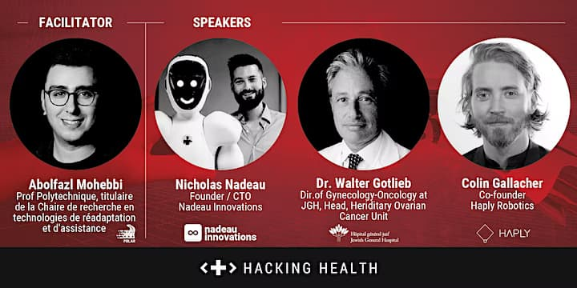

You are invited to an exclusive event featuring presentations and discussions with innovators bringing the value of robotics to healthcare throughout the patient journey, from physician training to treatment to post-operative care.

Join us to learn about how robotics revolutionizes patient care and develop your network in this growing industry.

👉 [Get your tickets here.](https://www.eventbrite.ca/e/robotics-in-medicine-value-throughout-the-patient-journey-tickets-488115896787) 👈

Society needs a solution for labor shortages and the need to create high-skilled jobs for our healthcare crisis and the devastating effects that will arise. The adoption of robotics in medicine may seem like something from a sci-fi movie. Still, the reality is that many solutions exist now that, once adopted, can alleviate many of our challenges.

During this event, we will showcase how robotics can offer value to patients throughout their journey. Speakers are from organizations with research departments based in Montreal, Quebec, and demonstrate the incredible capacity of our ecosystem to generate incredible innovations.

Event highlights:

- Learn about cutting-edge robotics technologies revolutionizing patient care
- Develop your network in this rapidly evolving and promising industry
