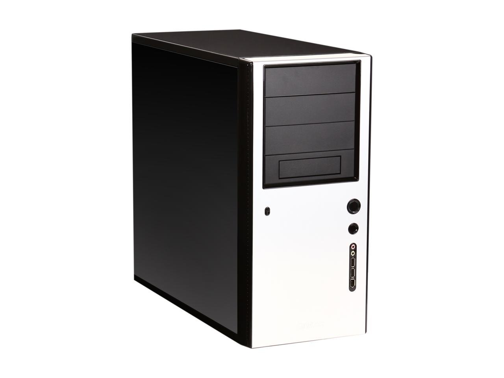
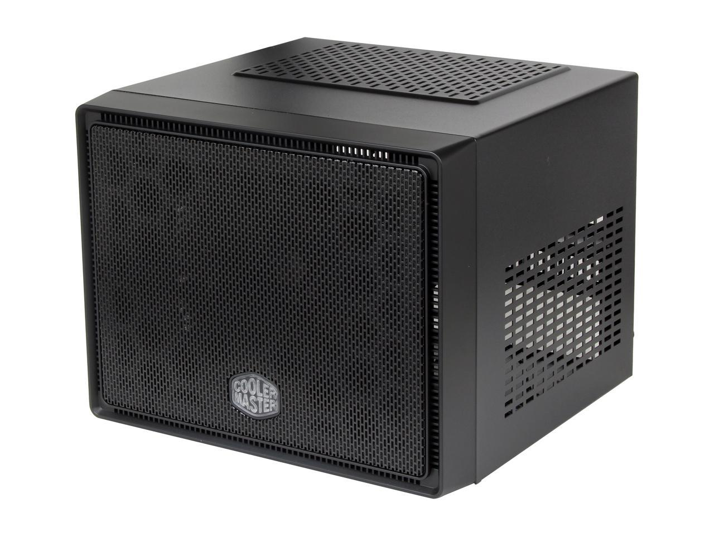
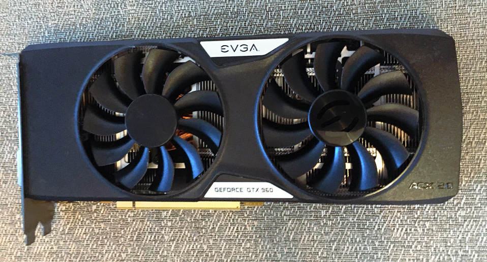
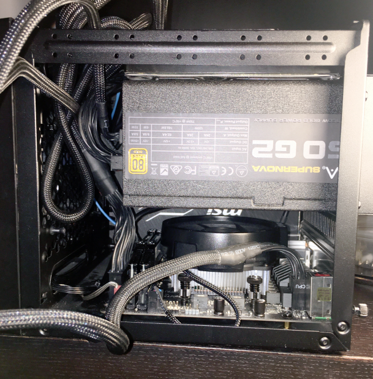
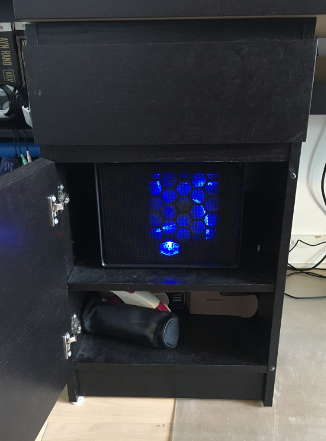
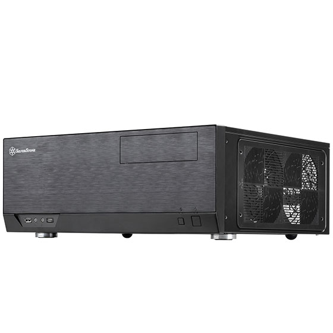
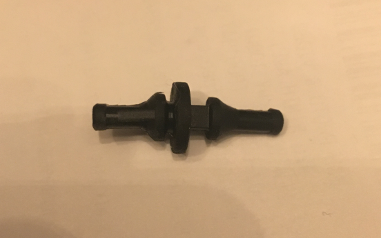
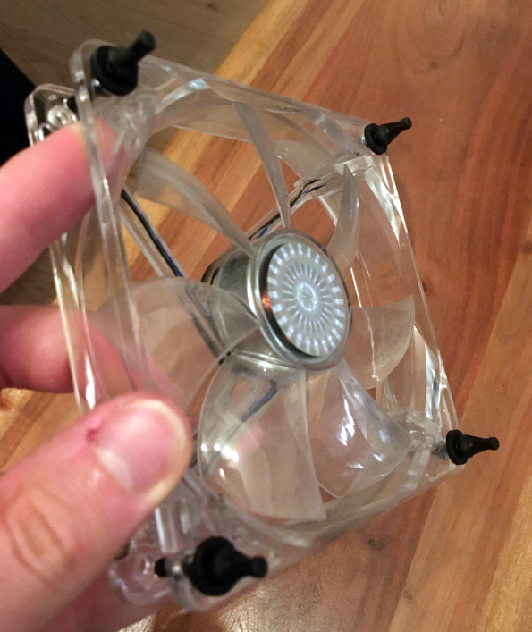
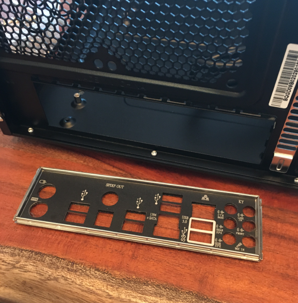

Building PCs is one of my favourite activities.
From the planning to the assembly process, to the first time it boots, it's an absolute thrill ride.

<!--more-->

## The Original Build

Earlier this year, I wanted to both upgrade and downsize my current computer setup.
For the past 5+ years I have been running an `Antec Solo` case with parts that were decently powerful enough that I could (moderately) keep up with PC gaming and *some* machine learning.
But now that I was done my PhD and had plans to reorganize my home office, this system was too big and it was time to downsize my primary machine.

So my requirements were pretty simple: upgrade my PC to be powerful enough for the next generation of gaming (i.e., [Half-Life: Alyx](https://store.steampowered.com/app/546560/HalfLife_Alyx/)) and hobbyist machine learning, while being small enough to eventually fit inside my living room TV stand. As such, I settled on the `COOLER MASTER Elite 110` case and the challenge of building a mini-ITX system.

As a cost cutting measure, I originally wanted to reuse my existing `GeForce GTX 960` video card and only upgrade when I was ready to take the plunge into VR gaming. I had the perfect plan, I built my parts list in [PCPartPicker](https://pcpartpicker.com/) and check for conflicts, and all looked good. I purchased everything and started assembling, and then it all went wrong...

My old video card didn't fit...
Apparently, there are multiple version of the `EVGA GeForce GTX 960 2 GB`, and I had the larger version but had selected the smaller version in PCPartPicker.
Lesson learned: enter parts by SKU number and not just their name.
So to solve this problem, I bought a `GeForce GTX 1660 Ti` that would fit.

The rest of the build went well, but WOW, mini-ITX cases are small.

For now, the little enclosure fits nicely inside my old `IKEA MALM` desk, but is ready for a future where I may give up my home office for it to become an extra bedroom.

Here's the full parts list:

[PCPartPicker Part List](https://ca.pcpartpicker.com/list/6BJc6R)

Type|Item|Price
:----|:----|:----
**CPU** | [AMD Ryzen 5 2600 3.4 GHz 6-Core Processor](https://ca.pcpartpicker.com/product/jLF48d/amd-ryzen-5-2600-34ghz-6-core-processor-yd2600bbafbox) | $208.37 @ Amazon Canada
**Motherboard** | [ASRock Fatal1ty B450 Gaming-ITX/ac Mini ITX AM4 Motherboard](https://ca.pcpartpicker.com/product/N4jJ7P/asrock-fatal1ty-b450-gaming-itxac-mini-itx-am4-motherboard-b450-gaming-itxac) | $197.65 @ Amazon Canada
**Memory** | [G.Skill Ripjaws V Series 32 GB (2 x 16 GB) DDR4-3200 CL16 Memory](https://ca.pcpartpicker.com/product/kXbkcf/gskill-memory-f43200c16d32gvk) | $179.99 @ Amazon Canada
**Storage** | [Kingston A400 240 GB 2.5" Solid State Drive](https://ca.pcpartpicker.com/product/btDzK8/kingston-a400-240gb-25-solid-state-drive-sa400s37240g) | $39.99 @ Amazon Canada
**Storage** | [Samsung 850 EVO-Series 250 GB 2.5" Solid State Drive](https://ca.pcpartpicker.com/product/3kL7YJ/samsung-internal-hard-drive-mz75e250bam) |-
**Video Card** | [MSI GeForce GTX 1660 Ti 6 GB VENTUS XS OC Video Card](https://ca.pcpartpicker.com/product/RGyV3C/msi-geforce-gtx-1660-ti-6-gb-ventus-xs-video-card-gtx-1660-ti-ventus-xs-6g-oc) | $419.99 @ Amazon Canada
**Case** | [Cooler Master Elite 110 Mini ITX Tower Case](https://ca.pcpartpicker.com/product/QCjG3C/cooler-master-case-rc110kkn2) | Purchased For $0.00
**Power Supply** | [EVGA SuperNOVA G2 750 W 80+ Gold Certified Fully Modular ATX Power Supply](https://ca.pcpartpicker.com/product/MfJwrH/evga-power-supply-220g20750xr) |-
**Case Fan** | [Vantec Stealth 28 CFM 92 mm Fan](https://ca.pcpartpicker.com/product/VxphP6/vantec-sf9225l-28-cfm-92-mm-fan-sf9225l) | $19.73 @ Amazon Canada
**Case Fan** | [Cooler Master R4-L2S-122B-GP 39.77 CFM 120 mm Fans 2-Pack](https://ca.pcpartpicker.com/product/4tzv6h/cooler-master-case-fan-r4l2s122bgp) |-
 | *Prices include shipping, taxes, rebates, and discounts* |
 | **Total** | **$1065.72**
 | Generated by [PCPartPicker](https://pcpartpicker.com) 2020-10-17 10:16 EDT-0400 |

## Second PC?

While my original idea for a smaller but powerful PC build went well, I was left with a bunch of extra PC parts.
My original plan was to **Reuse**, **Reduce**, and **Recycle**, but the only component I ended up reusing from my original PC was my modular PSU.
With basically a full PC worth of parts, I figured it would be a good opportunity to build a home theatre PC (HTPC).

Once again, I wanted this enclosure to also fit inside my TV stand, but with the constraint that it had to be an ATX enclosure for my old motherboard.
There isn't actually a lot of choice for horizontal ATX cases, but the `Silverstone GD09B` case *just* fit.
After finding a used `Corsair CX 430` PSU, I was ready to go.

Compared to the mini-ITX build, this enclosure offers **so much** space to work with and was a pleasure to assemble.
In the previous build, I had discovered [rubber anti-vibration fan mounts](https://www.amazon.ca/dp/B07BX91J3B) which revolutionized my fan mounting experience and I had the pleasure of using them again.

As a hardware engineer, one aspect of PC building that I'm always amazed by is part standardization.
My original motherboard, an `Asus P7P55D-E PRO`, is many years old.
It was actually one of the core reasons for a full PC upgrade, because it was difficult to find compatible CPUs or RAM.
But yet, even in my brand new case, the motherboard's IO shield *fits*.

Here's the full parts list for my *new* HTPC:

[PCPartPicker Part List](https://ca.pcpartpicker.com/list/2HKv8M)

Type|Item|Price
:----|:----|:----
**CPU** | [Intel Core i5-760 2.8 GHz Quad-Core Processor](https://ca.pcpartpicker.com/product/R6zv6h/intel-cpu-bx80605i5760) |-
**Motherboard** | [Asus P7P55D-E PRO ATX LGA1156 Motherboard](https://ca.pcpartpicker.com/product/fPqdnQ/asus-motherboard-p7p55depro) |-
**Memory** | [Corsair XMS3 8 GB (2 x 4 GB) DDR3-1333 CL9 Memory](https://ca.pcpartpicker.com/product/YQW9TW/corsair-memory-cmx8gx3m2a1333c9) | $57.52 @ Amazon Canada
**Storage** | [Samsung 840 EVO 120 GB 2.5" Solid State Drive](https://ca.pcpartpicker.com/product/zXjG3C/samsung-internal-hard-drive-mz7te120bw) |-
**Storage** | [Western Digital BLACK SERIES 1 TB 3.5" 7200RPM Internal Hard Drive](https://ca.pcpartpicker.com/product/Fz2kcf/western-digital-internal-hard-drive-wd1003fzex) | $89.10 @ Vuugo
**Video Card** | [EVGA GeForce GTX 960 2 GB SuperSC ACX 2.0+ Video Card](https://ca.pcpartpicker.com/product/ZMp323/evga-video-card-02gp42966kr) |-
**Case** | [Silverstone GD09B HTPC Case](https://ca.pcpartpicker.com/product/dsR48d/silverstone-case-gd09b) | $140.49 @ Amazon Canada
**Power Supply** | [Corsair CX 430 W 80+ Bronze Certified Semi-modular ATX Power Supply](https://ca.pcpartpicker.com/product/cvXfrH/corsair-power-supply-cx430m) |-
 | *Prices include shipping, taxes, rebates, and discounts* |
 | **Total** | **$287.11**
 | Generated by [PCPartPicker](https://pcpartpicker.com) 2020-10-17 22:23 EDT-0400 |
