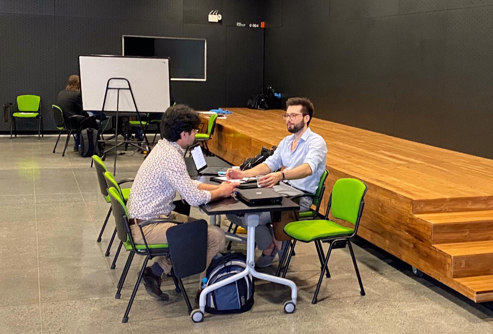

I recently had the opportunity (before the travel bans) to take part in a software developer recruiting mission in Medellin, Colombia through [VanHack](http://www.vanhack.com/).
VanHack is an interesting recruiting agency that connects international tech professionals with companies.

Over the course of a weekend, I interviewed nearly 30 incredible candidates.
If I had an unlimited budget, I would have hired the majority of them.
It was a very positive experience and I was fortunate to find a senior full-stack developer that fit my needs, something that I wasn't able to accomplish within Montréal.

My hire is now working remotely while we go through the [Global Talent Stream](https://www.canada.ca/en/employment-social-development/services/foreign-workers/global-talent/requirements.html) process to bring them to Canada.

Some key points for successful interviews and hiring:

1. Simplify your job descriptions with exactly what you need and are looking for, nothing more.
2. Approach the interview as a dialogue, especially for senior candidates.
3. Have candidates tell you stories about both successes and failures in their career, and see if they can dive into the decisions that led to those outcomes.
4. Be picky and don't settle.
5. Don't be afraid to explore outside of typical recruiting channels, as diversity is a key element of a strong team.


