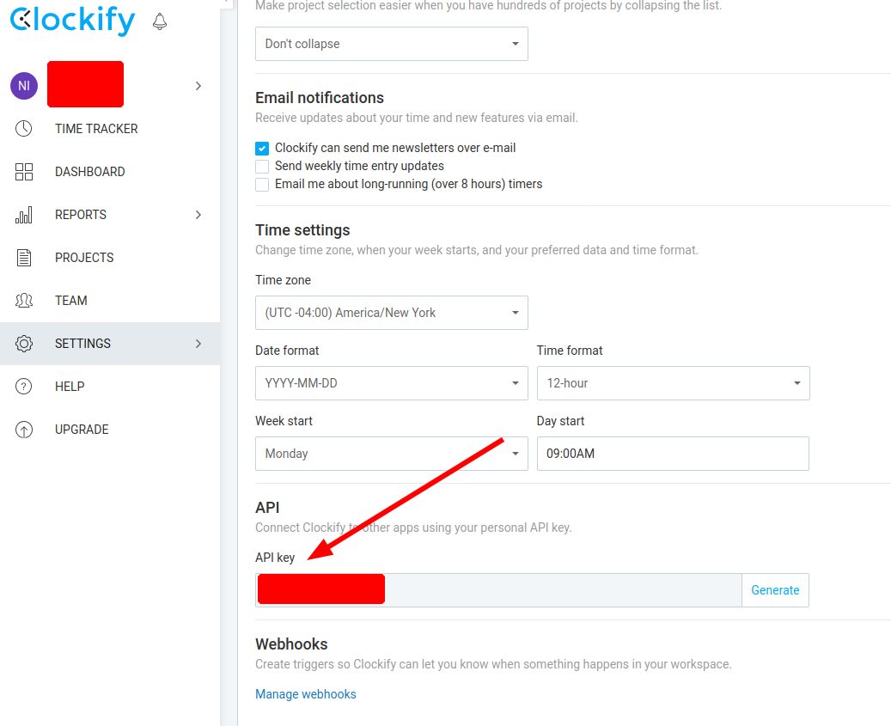
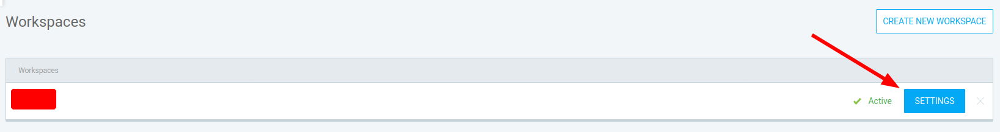
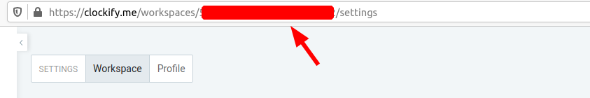

As a follow up to [my recent post](), we can easily push timesheet data to [Clockify](https://clockify.me/) using their API.

<!--more-->

## Clockify API Tokens

To get your API tokens, navigate to https://clockify.me/user/settings :



## Clockify Workspace ID

To get your workspace ID:

1. Navigate to https://clockify.me/workspaces/
2. Click `SETTINGS`

  

3. Copy the alphanumerical component of the URL

  

## Python Code

The following code snippet is an example Python script that pushes event data to Clockify.
The functions and CLI can either add a single event at a time or upload a CSV of many events.
The code may also be found in my [snippets repo](https://github.com/nnadeau/snippets).

The previously obtained API token and workspace ID can either be set as environment variables or set using command line arguments.

The following non-standard library packages are required: [`fire`](https://github.com/google/python-fire), [`pandas`](https://pandas.pydata.org/), and [`requests`](https://requests.readthedocs.io).

```python
import datetime
import logging
import os
from pathlib import Path
from typing import Optional

import fire
import pandas as pd
import requests

logger = logging.getLogger(__file__)


def add_event(
    description: str,
    duration: float,
    date: str,
    token: Optional[str] = os.getenv("CLOCKIFY_API_TOKEN"),
    workspace_id: Optional[str] = os.getenv("CLOCKIFY_WORKSPACE_ID"),
):
    # validate API variables
    if not workspace_id:
        logger.error(
            "workspace_id argument or CLOCKIFY_WORKSPACE_ID env variable must be set"
        )
        quit()
    if not token:
        logger.error("token argument or CLOCKIFY_API_TOKEN env variable must be set")
        quit()

    # set clockify api URL
    url = f"https://api.clockify.me/api/workspaces/{workspace_id}/timeEntries/"

    # build payload
    # start_dt is set to noon else clockify might set it the day before.
    start_dt = datetime.datetime.combine(
        datetime.date.fromisoformat(date), datetime.time(hour=12)
    )
    end_dt = start_dt + datetime.timedelta(hours=duration)

    fmt = "%Y-%m-%dT%H:%M:%SZ"
    data = {
        "start": start_dt.strftime(fmt),
        "end": end_dt.strftime(fmt),
        "description": description,
    }
    logger.info(f"Adding event: {data}")

    # post payload
    r = requests.post(url, json=data, headers={"X-Api-Key": token})
    logger.info(f"API response: {r}")


def add_csv(
    path: str,
    token: Optional[str] = os.getenv("CLOCKIFY_API_TOKEN"),
    workspace_id: Optional[str] = os.getenv("CLOCKIFY_WORKSPACE_ID"),
):
    path = Path(path).resolve()
    df = pd.read_csv(path)

    for _, s in df.iterrows():
        add_event(
            description=s["description"],
            duration=s["duration"],
            date=s["date"],
            token=token,
            workspace_id=workspace_id,
        )


if __name__ == "__main__":
    logging.basicConfig(level=logging.INFO)
    fire.Fire()

```

Since this script is built with the awesome [Python Fire](https://github.com/google/python-fire) library, it can easily be run as a command line tool:

```bash
# with implicit args
python3 push_clockify.py "My Event" 7 "2020-01-17"

# with explicit args
python3 push_clockify.py --description "My Event" --duration 7 --date "2020-01-17"
```
