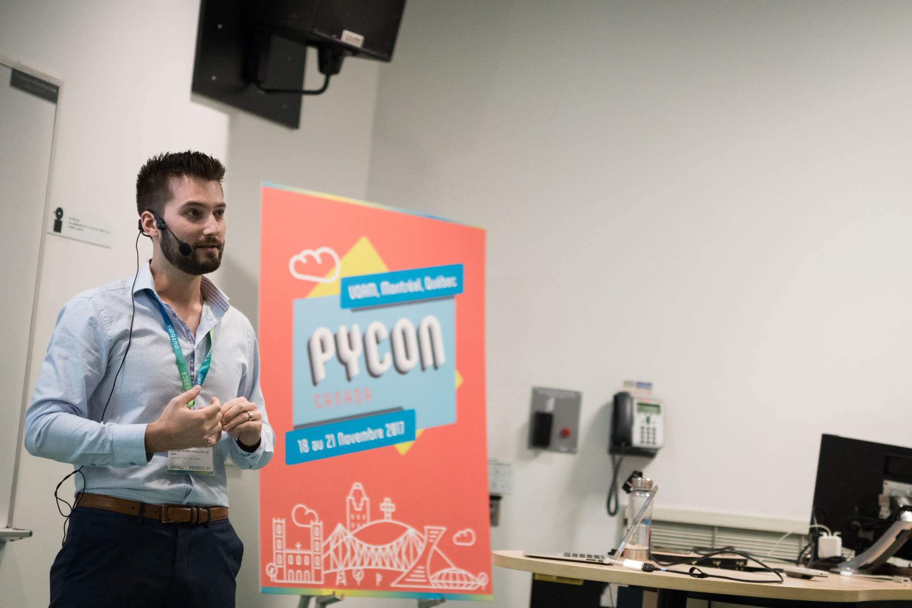

I spent a good part of my life in school, much of it studying engineering.
From a bachelor's degree in mechanical and biomedical engineering to a Ph.D. in collaborative robotics and machine learning, it was quite an adventure.

I was also fortunate to experience two universities with very different perspectives on engineering.
[McGill University](https://www.mcgill.ca/) was very theoretical-focused, with engineering taught as the application of pure science and mathematics.
[École de technologie supérieure (ÉTS)](https://www.etsmtl.ca/) was very practical-focused, with engineering being empirical and guided by experience.
Neither of these approaches is perfect, but the mixture of the two is what I feel modern engineering encompasses.

Now that I work in tech and scale teams, here are a few things that I wish were better taught during my studies that would have made me a better engineer from the start.
I hope these ideas will help future engineers looking to break into tech and give my interviewees a leg up on what I'm looking for in candidates.

## 1) Understanding fundamentals is more important than getting it right

When I was in school, my GPA was the highest priority. Now that I'm a hiring manager, I honestly have never looked at a candidate's GPA.
Unfortunately, I've noticed that GPA and other merit badges are often a privilege, especially when we think about diversity and inclusion, not necessarily a sign of future success.

It's too bad that academia often prioritizes getting the exact correct answer on a test during a specific three-hour window with a limited set of tools and resources.
Unless you're [Astronaut Mark Watney](https://en.wikipedia.org/wiki/The_Martian_(Weir_novel)), there are very few engineering situations that are this restrictive.

Nonetheless, having a core understanding of fundamentals will always guide you in sound engineering and decision-making directions.
In reality, engineering isn't always about achieving the perfectly right solution; it's about knowing why it's the best solution giving the situation.

## 2) Being a great engineer doesn't make you a great manager

Universities are very hierarchical.
You grow from freshman to senior, then maybe start a graduate degree and become a professor.
Many large engineering organizations are no different, starting as a junior engineer, becoming a senior engineer, and then being promoted to a manager position.

Then we run into the [Peter Principle](https://en.wikipedia.org/wiki/Peter_principle), that people in a hierarchy tend to rise to their "level of incompetence."
Technical leadership doesn't equate to people leadership, and schools need to explain these two career paths better.

Not all engineers will be technical gurus, and many top engineers shouldn't become managers.
There's a place for both skillsets and career growth opportunities; we need to be aware and make room for different people.

## 3) Basic programming skills aren't optional

When I attended McGill University's mechanical engineering program, we had a single class in Fortran and C.
They told us that these were the most crucial programming languages for mechanical engineers.
They lied.

My real awakening came much later on during an internship when I wanted to automate the tedious task of downloading data from a system.
I was extra excited because the company had a MATLAB license available for me, and I wanted to show off my "programming skills" (🙃).
Then I realized that TCP connections [required an additional toolbox add-on](https://www.mathworks.com/products/instrument/supported/tcp-ip.html).
Nearly everything in MATLAB requires a separate toolbox add-on, something universities supply to students without them realizing.
After some googling, I stumbled across this thing called "[Python](https://www.python.org/)," and my life changed forever.

Nowadays, so much of my hardware engineering work involves scripting or some basic programs in one way or another.
While it's not necessarily (yet) a requirement for being a hardware engineer, it's definitely at the top of the nice-to-have list.

While I personally highly recommend Python as an everyday language for engineers, it's better to think about it as just one tool in your toolbox.
What you want to achieve are outcomes, e.g.:

- Can you automate the analysis of a folder full of CSVs?
- Can you extract, transform, and load data into a pretty graph?
- Can you use the command line to connect to a device and modify its configuration?

## 4) Have full-stack knowledge but specialization expertise

This topic might be controversial, but I believe being an expert at one thing is better than being good at many things.
Startups and small companies often first gravitate towards hiring generalists that can wear many diverse hats, but this starts to break down during the growth phase when specialists are needed.
All that time spent having everyone do everything makes it more difficult to define specific roles and needs.

I like it better when I have specialists in well-defined roles.
Still, I also expect them to be knowledgeable across disciplines.
A baseline multidisciplinary knowledge allows for better cross-discipline teams, feeding directly into agile practices.

## 5) Great engineering doesn't happen without fantastic operations

Engineering is more than just creating great solutions; it's about getting those solutions into the world.
And this can't happen without an operations team.

Need to ship cargo internationally? Operations.
Need to coordinate vendors and maintain inventory? Operations.
Need to scale from prototype quantities to production quantities? Operations.

While many of the roles that Operations encompasses may not be purely technical, they are vital to the organization's success.
Engineering schools should devote an entire semester to just operations and understanding its nuances.
There's nothing better than an in-sync Engineering and Operations department working effectively together.

## 6) Just because it works doesn't mean it's production-ready

I've seen a lot of startups struggle with "but it works."
The MVP works, investors are happy, some clients are excited, so we can instantly shift to production mode, right?
Nope.

Transfer to production (TTP) is an art that requires forethought.
Amazon, eBay, and even McMaster-Carr aren't production suppliers.
If half your parts are 3D printed on a Prusa, it doesn't mean that suddenly it'll be doable to have them CNC'd in aluminum.
Raspberry Pis and Arduino Unos aren't production-grade SBCs or microcontrollers.

Yes, many of the above solutions and approaches can work during the scale-up phase.
Still, you have to be conscious of the long-term support costs of maintaining development and prototype parts in the field.
Zero to one is hard, but one to one hundred is a whole other problem that sneaks up on you.

## 7) Design for manufacturing, assembly, maintenance, and UX are sometimes more critical than pure innovation

If we continue our train of thought from the last point, design is more than just innovation.
As engineers, we want to build solutions that can make an impact on the world.
But these solutions need to be feasible, practical, and maintainable.

Unfortunately, few engineering schools teach product management.
Instead, I find Industrial Design programs do a better job at training for product design.

## 8) Think in problem space before jumping to solution space

This problem plagues both junior and senior engineers.
Junior engineers can move too fast and start designing solutions before fully understanding the full scope of the problem, all the requirements and stakeholders, and the collateral consequences.
Senior engineers can be stuck in their ways or jump straight to using a tool they like.

The trick is to explore and understand the problem space before jumping to solutions.
Force yourself to roughly follow the design cycle, define the [user stories](https://www.atlassian.com/agile/project-management/user-stories) and requirements, and develop a few alternative solutions (e.g., devil's advocate).

A great example is the Python community's [*Python Enhancement Proposals*](https://www.python.org/dev/peps/pep-0589/) (known as PEPs).
Writers of PEPs need to acknowledge community reaction, backward compatibility, and alternatives before a PEP can be accepted and implemented.

## 9) Proof of work is more important than degrees

Let's close the loop with a segue back to our first point: your experience is more important than a school, degree, certificate, or program.
Further, I rank experience as follows: academic < projects/research < industrial.

Engineering is about process and outcomes.
Employers look to see if you can apply your knowledge and generate results.
It doesn't matter how many online certificates in machine learning you have from Udacity; demonstrating your ability through projects and industrial experience will be a lot more powerful.

## 10) Be passionate and know what you like doing

There's nothing that differentiates an engineer more than someone genuinely passionate about what they do.
Those who seek out their passions and avoid doing work that they dislike are not only happier and more satisfied, but they're better engineers.

