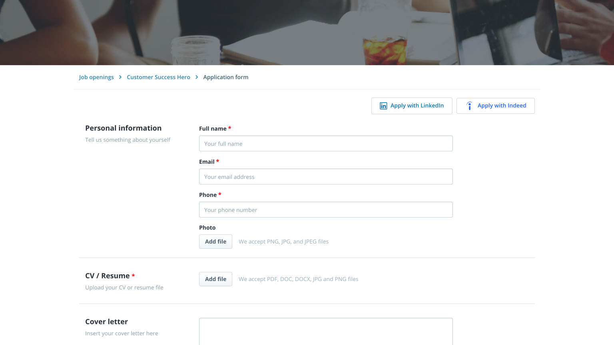
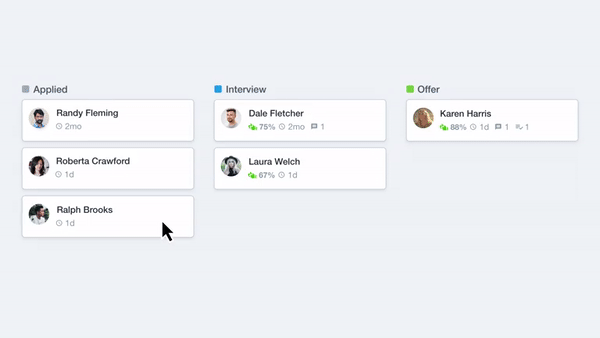
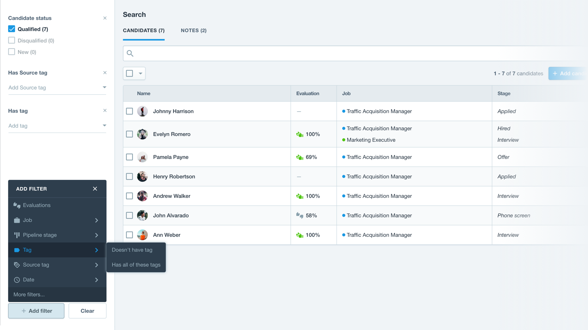
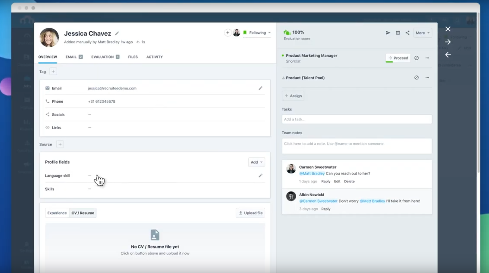

Recruiting isn't easy.
It can be a long and tedious process, especially for startups when you're building the infrastructure to support rapid growth.

I used to think that recruiters and hiring managers were cold and rude.
They didn't see my potential or didn't take enough time to understand why I'm the right fit.
But now that I've been on both sides of the process, I've realized that it wasn't their fault; the process is often exhausting for all parties involved.

For instance, [Halodi Robotics](https://halodi.com/careers) is still a small company.
We don't have teams of HR people and recruiters yet.
It's us, the engineers and managers, doing all the hiring and all the interviewing.
We're doing this time-consuming process while also trying to run the company and develop next-generation robotic solutions.

Candidates lack insight into what actually happens behind the scenes of a recruitment process.
This article is my attempt to shed some light on the hiring process for potential candidates to make it easier for all parties involved.

## 1) Your CV is your first impression.

There are tons of articles discussing how your CV has less than ten seconds to catch my attention, and it's not untrue.
Hiring managers don't actually have a lot of time to review your CV.

Just in the past three months, [Halodi Robotics](https://halodi.com/careers) has received thousands of applicants for the positions we've posted.
While I'm thankful to have my colleagues at [Pivot+Edge](https://www.pivotandedge.com/) support this process, there are still many CVs to parse.

Honestly, reviewing CVs all day is very tiring.
This means that your CV has to really stand out amongst the crowd, but not necessarily in any weird pizzazz way.

I've seen overly colourful CVs trying to do fancy things like using pictograms that depict skill capabilities.
Honestly, don't.
It's not very helpful.
I don't understand what 7/10 filled-in dots means about your Python skills.

I need CVs that are clean, consistent, and straight to the point.
If I'm only going to spend a few seconds on your CV, I need to know who you are, what you accomplished, and what value you'll bring to us.
I want to get right to the information I need.

Have your work experience right at the top.
Have everything in reverse chronological order so that I can trace your history and understand your career path.
Be clear and concise with what you did and what outcomes you achieved, but don't just copy-paste your job descriptions.
Make it very easy for me to extract right away why you're the person that will achieve the outcomes I need.

And please, do not just list every technology you've ever worked with, have seen, or have heard of.
This is keyword stuffing, and I'm not a search engine.
If your CV lists every known technology or framework, I'll doubt that you're actually an expert on every single one.
I'd instead have candidates list their top three to five skills and then demonstrate that they're agile enough to jump to other technologies.

Also, please submit only PDFs, not Microsoft Work DOCX files.
Make sure your CV correctly renders if someone were to open it in a preview window.

## 2) Cover letters are your trojan horse.

Make sure to have a cover letter.
It doesn't have to be lengthy or fancy.
Honestly, just one or two paragraphs that tell me who you are and why you're the person who should be in this role.

Most importantly, use the cover letter to connect the dots for me.
I might not interpret your CV the way you'd expect me to, so tell me how I should do it.
Focus my attention where it should be focused.
Influence me to see your candidature in the most optimal way.
This is especially important when your CV doesn't necessarily fit the stereotypical profile I might have in mind.

If you expect me to connect the dots of your background for you, then you're not setting yourself up for success.
The cover letter is your way to influence the direction of my thinking.
But don't be verbose.
Make it concise and straight to the point.

## 3) Your candidature goes into a system.

I've worked with many different processes and systems for recruitment in my career.
Sometimes we have chaos: CVs coming in from various sources, including email and LinkedIn messages, and no central platform to manage the process.
Good companies have a process: all CVs enter an [Applicant Tracking System (ATS)](https://en.wikipedia.org/wiki/Applicant_tracking_system) and are managed efficiently.

At Halodi Robotics, we use [Recruitee](https://recruitee.com/), a lightweight ATS that works like a kanban board.
It's excellent, simple, and I love it.

Below are some images from [Recruitee's press kit](https://go.recruitee.com/press) to give you an idea of what I see when working with the system.
First, candidates enter their information into a standardized application with fields.
Their CV is also uploaded to the system.

Next, we have the candidate kanban where hiring managers are able to follow candidates through the process.

We're also able to efficient search, sort, and parse for candidates.

Finally, candidate profiles are simplified to include the core information and their CV.

I also recommend the watching the following YouTube videos to get a better understanding of the product that we use.





Without these ATS platforms, we would be overwhelmed and disorganized, and then no one would get hired.

## 4) Get my attention... in the right way.

Now that we know about the backend systems let's talk about LinkedIn:

*Please don't cold message me and send your CV through a LinkedIn message.*

During hiring sprints, I personally get flooded with many connection requests and messages.
Many of these messages consist of a wall of text and an attached CV.
Many of these messages ask that I review their profile and find a place for them at the company without having checked our careers page or job postings.

While I may not always have time to give verbose LinkedIn messages a full review, I don't ghost people.
Here's my template response that I'll often copy-paste:

> Hi! Thanks for reaching out! Best to apply through our careers page (https://halodi.com/careers) and join our Talent Network (https://mailchi.mp/halodi/talent-network-sign-up) to stay in the loop with all our updates and new job opportunities

My templated response has two hints for candidates:

1. Use the standard process (e.g., careers page, LinkedIn job posts) to get your name into our system.
2. Engage with us.

So, instead of cold messaging me your CV and a wall of text, a more effective and respectful approach would be something like:

> "Hi, Nicholas! I just wanted to let you know that I applied for the ABC role, and I'm looking forward to hearing back. I've been following your work for a while now and was very impressed by XYZ. Have a great day!"

Using the standard process and personally signalling me with a concise and respectful "hello" is advantageous.
It demonstrates that you understand that there's a process and that you are very interested and enthusiastic.

## 5) Show me results and outcomes.

This topic relates back to a [previous post I wrote about the problems of engineering education]().
Your education, online certificates, and even sometimes the places you worked don't mean much on their own.

Show me that you can deliver results.
Demonstrate proof of work.

While having access to technology and education is a privilege, having a portfolio or blog is free.
Demonstrate that you're the right person to deliver the outcomes and value that we need with the timeframes and resources we're constrained by.

Engineering isn't about doing work and keeping busy; it's about bringing solutions to the real world.
It's results-driven.

If you're a senior candidate, tell me about the times that you lead teams and made technology decisions and how that worked out.
Who were the stakeholders, and what were the requirements or user stories that you had to overcome?

If you're a junior candidate, tell me how you are gung ho and energetic to learn and drive forward.

If you're interviewing for a design position, talk about your methodology and your experience with the complete product lifecycle.

Tell me about projects that you've worked on and what you contributed.
Have links to YouTube videos, GitHub repositories, or other tangible demonstrations of results and outcomes.
This helps me better understand that you are a person who is capable of delivering results.

## 6) Tell me a story.

During interviews, two of my favourite generic questions are:

1. What's your biggest success?
2. What's your biggest failure?

I want to hear about how you genuinely embody and own your work.
I want to hear about your most significant achievements and accomplishments. What led to this achievement?
How were you part of making that achievement possible?
How did you make this outcome a reality?

On the other hand, I also want to hear about your biggest failures, when things didn't work out, and when things completely fell apart.
I love hearing stories where prototypes exploded (e.g., rapid unplanned disassembly events) or production databases that were dropped on a Friday afternoon.
But aside from great stories, this question lets me see if you understand why this outcome happened and if you could have done something different.
What did you learn about that failure?
How do you ensure that this outcome never occurs again?

This is especially important for senior candidates.
If you're 5+ years into your career, and you haven't had a failure yet, then you're lying, or you haven't pushed yourself.

Mistakes are part of engineering, and being accountable, owning up to them, and learning from them are the most essential core values of an engineer.

I want to hire candidates who have made mistakes before, so they won't make those same mistakes again.
I want to count on them to be champions of process improvements and to better our organization.

## 7) Know who we are; engage with us.

Please come prepared for interviews.
Please have watched our [YouTube videos](https://www.youtube.com/channel/UC-wD_-lBT2h9jE9xJvRenkA) and have read our [recent announcements](https://halodi.com/news) or [blog posts](https://medium.com/halodi-news).
Know [what we're doing](https://halodi.com/news/halodi-robotics-secures-10m-in-funding-to-bring-humanoid-robots-into-real-world-applications-in-a-series-a-round-led-by-valinor-and-adt).

But you'll never know everything, so engage with us, both during the interview and through social media.

During interviews, there's nothing that disappoints me more than a candidate that has no questions.
I always leave a good 15 or so minutes at the end of interviews for the candidate to ask questions and hopefully interview me back.
I want candidates to engage, to dig deeper into the role and the company because it shows that they're insightful and already embodying being part of the team.

Here are some of my favourite examples of engaging interviews from over the years that set the candidates apart:

- A candidate asked me: "What's the most difficult part about working with you?"
- A full-stack developer candidate asked me: "Did you know that your website is poorly configured and has some vulnerabilities? Don't worry, I'll email you instructions on how to fix it."
- An engineer had a short two-minute presentation of robots that they designed as a side-project, the manufacturing challenges, and the user stories that initiated this endeavour.
- A developer noticed that we didn't have a feature on our system, so they created an MVP and demoed it.
- A candidate presented a startup that they attempted, the mixture of hardware and software development they had to learn to create an MVP, and why the venture eventually failed.

Beyond just interviews, play to my character and our company's brand.
Get my attention by interacting with [my blog](), my [LinkedIn](https://www.linkedin.com/in/engnadeau), or my [Twitter](https://twitter.com/EngNadeau).
Set yourself apart from the rest of the candidates and show me your personality and values.
Tag the [company](https://www.linkedin.com/company/halodi) or [me](https://www.linkedin.com/in/engnadeau) on social media and engage with us; use it to your advantage.

Above all, we value **performance**, **innovation**, **teamwork**, and **purpose**.
Be yourself and show us how you embody these values.

Join us and push the future of humanoid robotics forward 🤖🚀
