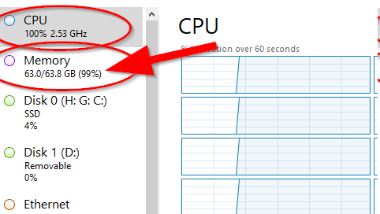

---
aliases:
- /post/2022/7/debugging-yocto-dofetch-failed-to-fetch-url/
authors: []
categories: []
date: "2022-07-26T09:17:56-04:00"
draft: false
featured: false
image:
  caption: ""
  focal_point: ""
  preview_only: false
lastmod: "2022-07-26T09:17:56-04:00"
projects: []
subtitle: ""
summary: ""
tags:
- yocto
- nvidia
title: 'Debugging Yocto `do_fetch`: Failed to fetch URL'
---

I recently ran into a Yocto build issue with `libglvnd` while building [`meta-tegra`](https://github.com/OE4T/meta-tegra) for an NVIDIA Xavier AGX.

<!--more-->

```bash
NOTE: Executing Tasks
WARNING: libglvnd-1.4.0-r0 do_fetch: Failed to fetch URL git://gitlab.freedesktop.org/glvnd/libglvnd.git;protocol=https;branch=master, attempting MIRRORS if available
ERROR: libglvnd-1.4.0-r0 do_fetch: Fetcher failure: Fetch command export PSEUDO_DISABLED=1; export PATH="/home/nicholas/git/yocto/build/jetson/tmp/sysroots-uninative/x86_64-linux/usr/bin:/home/nicholas/git/yocto/build/jetson/tmp/work/armv8a_tegra-poky-linux/libglvnd/1.4.0-r0/recipe-sysroot-native/usr/bin/python3-native:/home/nicholas/git/yocto/sources/poky/scripts:/home/nicholas/git/yocto/build/jetson/tmp/work/armv8a_tegra-poky-linux/libglvnd/1.4.0-r0/recipe-sysroot-native/usr/bin/aarch64-poky-linux:/home/nicholas/git/yocto/build/jetson/tmp/work/armv8a_tegra-poky-linux/libglvnd/1.4.0-r0/recipe-sysroot/usr/bin/crossscripts:/home/nicholas/git/yocto/build/jetson/tmp/work/armv8a_tegra-poky-linux/libglvnd/1.4.0-r0/recipe-sysroot-native/usr/sbin:/home/nicholas/git/yocto/build/jetson/tmp/work/armv8a_tegra-poky-linux/libglvnd/1.4.0-r0/recipe-sysroot-native/usr/bin:/home/nicholas/git/yocto/build/jetson/tmp/work/armv8a_tegra-poky-linux/libglvnd/1.4.0-r0/recipe-sysroot-native/sbin:/home/nicholas/git/yocto/build/jetson/tmp/work/armv8a_tegra-poky-linux/libglvnd/1.4.0-r0/recipe-sysroot-native/bin:/home/nicholas/git/yocto/sources/poky/bitbake/bin:/home/nicholas/git/yocto/build/jetson/tmp/hosttools"; export HOME="/home/nicholas"; LANG=C git -c core.fsyncobjectfiles=0 -c gc.autoDetach=false -c core.pager=cat clone --bare --mirror https://gitlab.freedesktop.org/glvnd/libglvnd.git /home/nicholas/git/yocto/build/jetson/../downloads/git2/gitlab.freedesktop.org.glvnd.libglvnd.git --progress failed with exit code 128, no output
ERROR: libglvnd-1.4.0-r0 do_fetch: Bitbake Fetcher Error: FetchError('Unable to fetch URL from any source.', 'git://gitlab.freedesktop.org/glvnd/libglvnd.git;protocol=https;branch=master')
ERROR: Logfile of failure stored in: /home/nicholas/git/yocto/build/jetson/tmp/work/armv8a_tegra-poky-linux/libglvnd/1.4.0-r0/temp/log.do_fetch.32151
ERROR: Task (/home/nicholas/git/yocto/sources/meta-tegra/recipes-graphics/libglvnd/libglvnd_1.4.0.bb:do_fetch) failed with exit code '1'
NOTE: Tasks Summary: Attempted 1173 tasks of which 1137 didn't need to be rerun and 1 failed.
NOTE: Writing buildhistory
NOTE: Writing buildhistory took: 3 seconds
```

The recipe [`libglvnd_1.4.0.bb`](https://github.com/OE4T/meta-tegra/blob/8b61699119802529574531be3d5103fd01c47f9a/recipes-graphics/libglvnd/libglvnd_1.4.0.bb) was continuously failing at the `do_fetch` step, which was really weird because:

- The [git repo](https://gitlab.freedesktop.org/glvnd/libglvnd) was fully public and accessible (i.e., `SRC_REPO`)
- The branches matched (i.e., `SRCBRANCH`)
  - This was a [common issue](https://stackoverflow.com/a/68216728) when everyone renamed their default branches from `master` to `main`
- The hashes matched (i.e., `SRCREV`)

The next step was to try manually cloning the repo:

```bash
$ git clone https://gitlab.freedesktop.org/glvnd/libglvnd
Cloning into 'libglvnd'...
fatal: unable to access 'https://gitlab.freedesktop.org/glvnd/libglvnd/': server certificate verification failed. CAfile: none CRLfile: none
```

That's interesting!
A little googling led me to a [Stack Overflow](https://stackoverflow.com/a/35824116) post with the solution:

```bash
sudo apt-get install --reinstall ca-certificates
```

Apparently my SSL certs were out of date... 🤦‍♂️

Now everything works!

Building Yocto makes my laptop go brrrr 🔥

