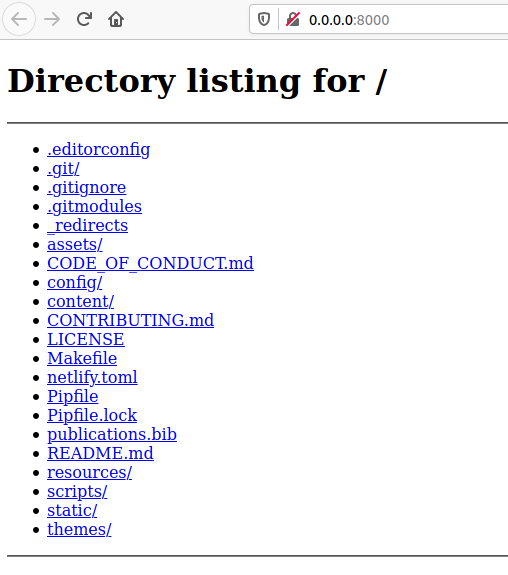

---
aliases:
- /post/dev-tip-quickly-share-files
- /post/2020/4/dev-tip-quickly-share-files/
authors: []
categories: []
date: "2020-04-06T07:42:59-04:00"
draft: false
featured: false
image:
  caption: ""
  focal_point: ""
  preview_only: false
lastmod: "2020-04-06T07:42:59-04:00"
projects: []
subtitle: ""
summary: ""
tags:
- bash
- hostname
- ngrok
- port
- python
- server
- web
title: 'Tip of the Day: Quickly Share Files with Python and ngrok'
---

Sometimes I just need to transfer a file across computers without the fuss of `ssh`, Google Drive, Firefox Send, etc.
Examples include:

- Sharing a large video file with a colleague
- Transferring eBooks to a Kobo using the [beta web browser](https://help.kobo.com/hc/en-us/articles/360017763733-About-Beta-Features)
- Making a local share for a team to access data

## Setting Up the Web Server

In your terminal, run the following:

```bash
# start a webserver that serves the current directory
# e.g., Serving HTTP on 0.0.0.0 port 8000 (http://0.0.0.0:8000/)
python3 -m http.server
```

In a browser, check to make sure everything is working (e.g., navigate to `http://0.0.0.0:8000/`). Example of serving project directory:



## Creating a Public URL

If your PC is exposed to your internal network, you can simply share its local IP (order better yet, [its hostname]()) and the port number that's being served (e.g., `192.168.0.123:8000`).
In your terminal, run the following:

```bash
# get your current IP address to share with others
# e.g., 192.168.0.123
ip a

# get your current hostname
hostname
```

This would be good enough to share with friends/colleagues/yourself in an office or home network.

What about if you want to share your files externally and publicly?
That's where [ngrok](https://ngrok.com/) comes in.
In a new terminal, run the following:

```bash
# expose a local web server to the internet
# assumes default port of python web server (i.e., 8000)
ngrok http 8000
```

And that's it!
Copy and share the public URLs provided and anyone with the (obfuscated) URL can access your exposed directory.
This exposure will last as long as the `ngrok` tunnel or Python web server is running.

Here's an example of `ngrok`'s output while testing this [`hugo`](https://gohugo.io/) website when I run `hugo serve` and `ngrok http 1313` to expose my local web server (`http://localhost:1313`):

```bash
ngrok by @inconshreveable                                                                (Ctrl+C to quit)

Session Status                online
Account                       Nicholas Nadeau (Plan: Free)
Version                       2.3.35
Region                        United States (us)
Web Interface                 http://127.0.0.1:4040
Forwarding                    http://825420f6.ngrok.io -> http://localhost:1313
Forwarding                    https://825420f6.ngrok.io -> http://localhost:1313
```