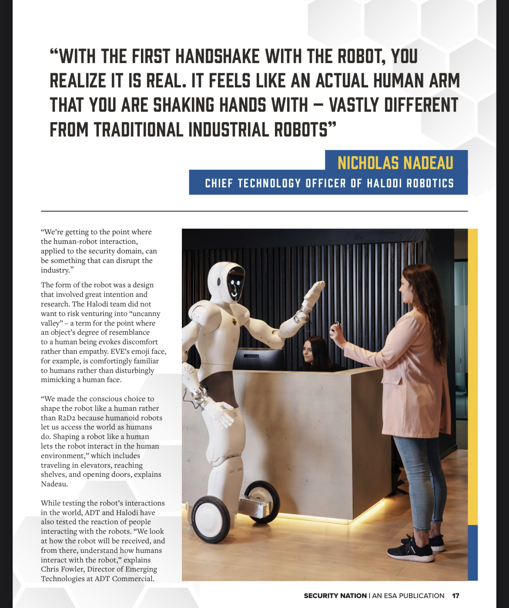

More robotic capabilities and cost-effective technology make 2022 the right time for humanoid robot security guards.

> Three of ADT Commercial's customers will be testing Gemini, the current Halodi robot prototype, in 2022; with two robots per site, they'll have the opportunity to identify the benefits of the robots and make suggestions for further development.

> "We made the conscious choice to shape the robot like a human rather than R2D2 because humanoid robots let us access the world as humans do. Shaping a robot like a human lets the robot interact in the human environment," which includes traveling in elevators, reaching shelves, and opening doors, explains Nadeau.

> Because robots don't take home paychecks or require health insurance, robots like Gemini can significantly reduce security cost while increasing security capability.

Read the full article in [ESA Security Nation magazine](https://esaweb.org/resources/securitynation/) or [directly on the ESA site](https://esaweb.org/slowly-bot-surely/).
