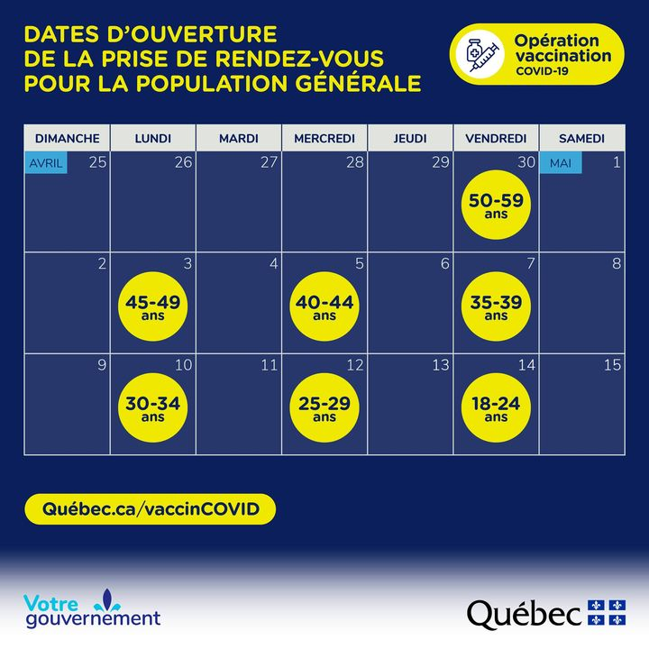
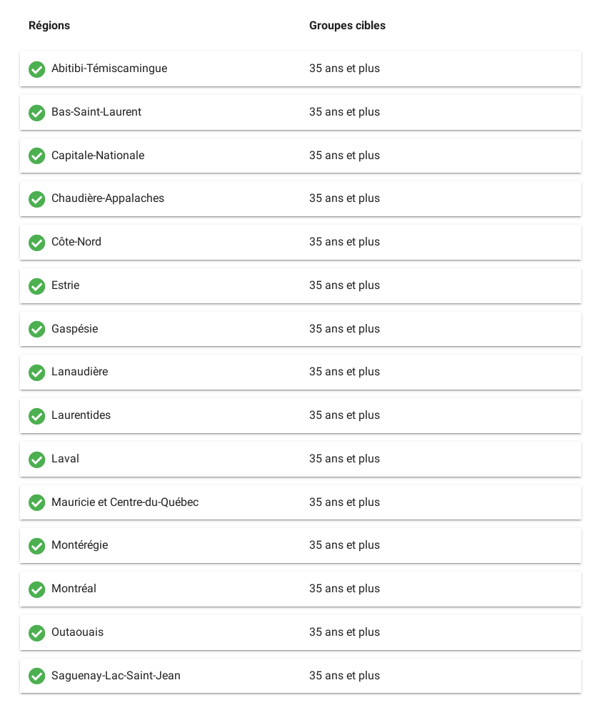

---
aliases:
- /post/2021/5/how-i-used-python-monitor-quebec-vaccine-website-to-get-the-first-available-appointment/
authors: []
categories: []
date: "2021-05-21T10:35:34-04:00"
draft: false
featured: false
image:
  caption: ""
  focal_point: ""
  preview_only: false
lastmod: "2021-05-21T10:35:34-04:00"
projects: []
subtitle: ""
summary: ""
tags:
- covid-19
- python
- web scraping
- html
- requests
title: How I Used Python to Monitor Santé Québec's Vaccine Website to Get the First
  Available Appointment for My Age Group
---

I really wanted my vaccine and I wanted to be first in line when it was my turn.

Québec has been doing a vaccination rollout plan based on age groups and we register for our vaccine through [a web portal](https://portal3.clicsante.ca/).
There's also [a summary page](https://portal3.clicsante.ca/covid-vaccination-ouverture) that shows the vaccine availability per region by age group.



Santé Québec also has a great [Twitter account](https://twitter.com/sante_qc) that has been keeping us informed of daily statistics, major announcements, and the rollout plan.



## The Opportunity

Thanks to some commenters on Twitter, I also noticed that the website would allow registration of the next age group the day before the planned opportunity.
This was most likely due to allowing the CDNs time to propagate any changes and to debug any problems before the rushing waves of registrations.


Regardless, I saw my opportunity.

## The Plan

I put together a quick Python web scraping script to monitor for changes on the website.
As I'm part of the 30+ age group, I waited until the day before my official opportunity to monitor the change from `35+` to `30+`.



## The Tool

My tool's design was quite simple and terrible for anything that isn't a gorilla tactic like I did.

Please don't use infinite loops in real life.
Do as I say, not as I do.

I used [`requests-html`](https://docs.python-requests.org/projects/requests-html/) to scrape and render the website content.
Since my home PC with the loudest speakers is Windows-based, I used the built-in [`winsound`](https://docs.python.org/3/library/winsound.html) module to create a really annoying alert.

I also noticed that the webpage was really simple and I could just `splitlines()`, look for the index of `Montréal`, and keep an eye on the next value in the list which was the age group.

```text
COVID-19 Ouverture de la vaccination dans votre r�gion | Portail Clic Sant�
We're sorry but portal doesn't work properly without JavaScript enabled. Please enable it to continue.
menu
Accueil
Annuler un rendez-vous
FRAN�AIS
R�servez votre rendez-vous
sant� d�s maintenant!
COVID-19: Ouverture de la vaccination dans votre r�gion
R�gions
Groupes cibles
Abitibi-T�miscamingue
18 ans et plus
Bas-Saint-Laurent
18 ans et plus
Capitale-Nationale
18 ans et plus
Chaudi�re-Appalaches
18 ans et plus
C�te-Nord
18 ans et plus
Estrie
18 ans et plus
Gasp�sie
18 ans et plus
Lanaudi�re
18 ans et plus
Laurentides
18 ans et plus
Laval
18 ans et plus
Mauricie et Centre-du-Qu�bec
18 ans et plus
Mont�r�gie
18 ans et plus
Montr�al
18 ans et plus
Outaouais
18 ans et plus
Saguenay-Lac-Saint-Jean
18 ans et plus
Retour � la page d'accueil
Accueil
Termes et conditions
Politique sur la protection des renseignements personnels et confidentiels
close
Ce site utilise des t�moins (Cookies) afin de vous offrir la meilleure exp�rience possible. Pour plus d'information, visitez notre: Politique de protection des renseignements personnels et confidentiels
Ok
```

### The Script

```python
import logging
import winsound
from time import sleep

from requests_html import HTMLSession

URL = "https://portal3.clicsante.ca/covid-vaccination-ouverture"
KEY = "Montréal"

logging.basicConfig(
    format="'%(asctime)s - %(levelname)s - %(message)s'", level=logging.INFO
)


def alert_me():
    while True:
        # the fifth A is 440 Hz
        # https://en.wikipedia.org/wiki/Piano_key_frequencies
        winsound.Beep(frequency=440, duration=1000)
        sleep(0.5)


def main():
    last_value = None

    while True:
        # load webscraping session
        session = HTMLSession()
        r = session.get(URL)
        r.html.render()

        # get lines of text from page
        lines = r.html.text.splitlines()

        # fetch location to watch
        try:
            key_idx = lines.index(KEY)
        except ValueError as e:
            logging.error(e)
            continue
        watched_idx = key_idx + 1

        # check value
        if not last_value:
            # set our watch value
            last_value = lines[watched_idx]
            logging.info(f"Setting watch value to: {last_value}")
            logging.info(f"{KEY}: {last_value}")
        elif last_value != lines[watched_idx]:
            # found something, break loop
            break

        logging.info(f"{KEY}: {last_value}")

    # ring alarm
    alert_me()


if __name__ == "__main__":
    main()
```

## The Result

At 3:43PM on May 9th, Santé Québec tweeted:



I wasn't the only one who was prepared:



My script was running, I was ready.

At around 4PM my script's alarm started blaring!
By 4:19PM I was booked for the first slots.

