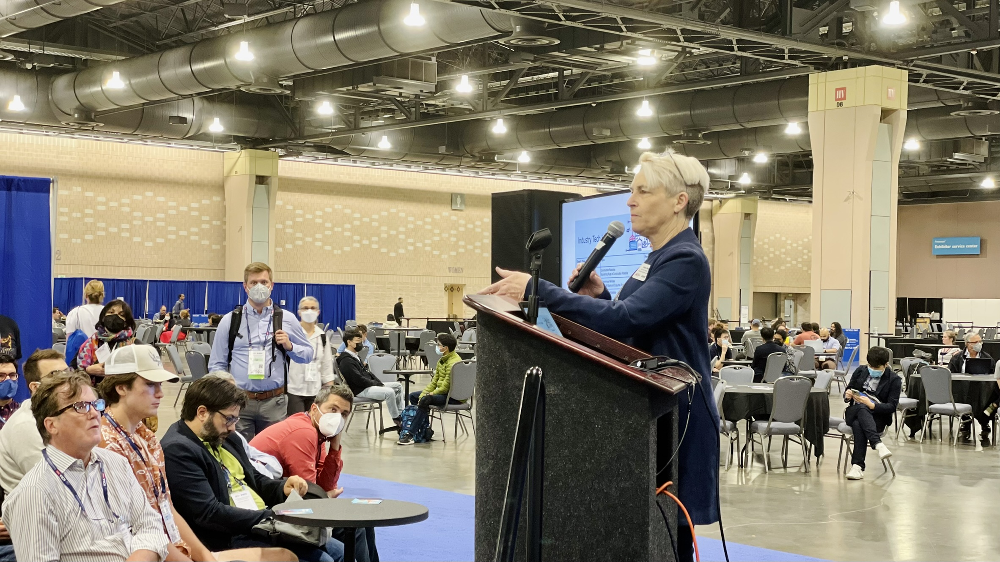
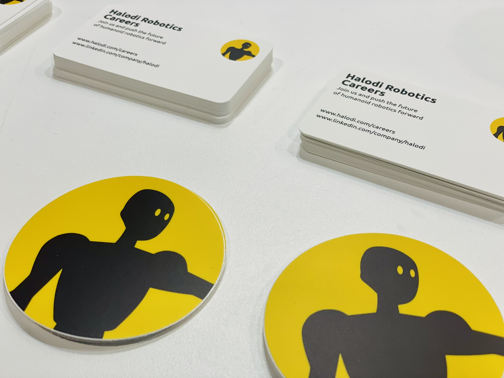

ICRA 2022 came and went and it was wonderful to be back in-person with the robotics research community.
It was also really great to finally meet some colleagues (and heros), such as [Andra Keay](https://www.linkedin.com/in/andra-keay/) and [Ken Goldberg](https://twitter.com/Ken_Goldberg) in-person after a couple years of collaboration over virtual chats.

From a professional perspective, [Halodi Robotics](https://www.halodi.com/) had a very [successful recruitment mission](https://www.halodi.com/careers) and I'm excited for the next generation of diverse robotics engineers.

From a personal perspective, it felt great to see the latest in robotics research and brings me back to the days when I was chasing conferences as a grad student.





Big shoutout to my *alma mater* [robotics lab at ETS](https://en.etsmtl.ca/unites-de-recherche/coro/accueil?lang=en-CA) for their awesome presentation on tactile sensors.



I'm looking forward to ICRA 2023 in London, but at least I have a bunch of new laptop stickers to keep me company until then.


