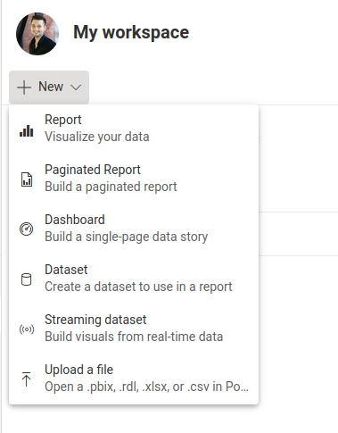
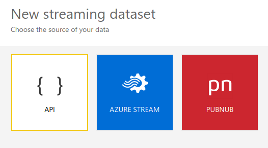
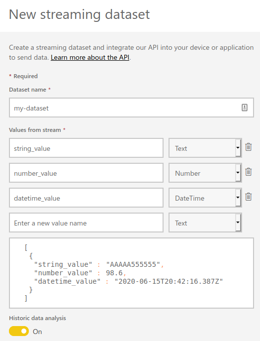
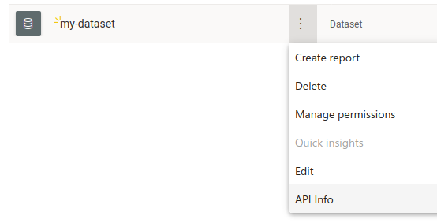
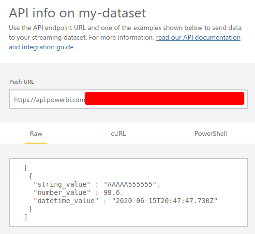

[Power BI](https://powerbi.microsoft.com/) is a business analytics service by Microsoft that aims to provide data visualizations and business intelligence capabilities through simple report and dashboard tools.

One interesting feature is the ability to create [Streaming Datasets](https://docs.microsoft.com/en-us/power-bi/connect-data/service-real-time-streaming) that can receive data through a simple [REST API](https://en.wikipedia.org/wiki/Representational_state_transfer).
With this feature, data can be streamed in real-time to update dashboards.

With just a few lines of Python and the [`requests`](https://requests.readthedocs.io/) package, getting up and running with the Streaming Datasets feature is quick and easy.

## Setting Up a Streaming Dataset

- In [your dashboard view](https://app.powerbi.com/groups/me/list/dashboards), create a new `Streaming dataset`



- Select `API`



- Fill in the desired data structure and value types



- Make sure to activate `Historic data analysis` if you want data to be cached and retained for longer-lasting analytics
- Click `Create` and you're done!

## Get API URL

- In [your dashboard view](https://app.powerbi.com/groups/me/list/dashboards), select your new dataset and click `API Info`



- Copy the provided `Push URL` that will be used in a Python code below



## Python Code to Push Data

The following code will push data to the previously created API.
Each time this script is run, a new data payload is sent to the Power BI dataset.
Integrating this code into an IoT device (e.g., Raspberry Pi sensor) or a cron job can allow for simple data logging and dashboard views.

```python
from datetime import datetime
import requests
import json

# copy "Push URL" from "API Info" in Power BI
url = "https://api.powerbi.com/beta/ABC-XYZ"

# timestamps should be formatted like this
now = datetime.strftime(
  datetime.now(),
  "%Y-%m-%dT%H:%M:%S"
  )

# data dict must be contained in a list
data = [
  {
    "string_value": "ABC XYZ",
    "number_value": 12345,
    "datetime_value": now
    }
  ]

# post/push data to the streaming API
headers = {
  "Content-Type": "application/json"
  }
response = requests.request(
    method="POST",
    url=url,
    headers=headers,
    data=json.dumps(data)
)
```

If all goes well, the returned `response` object will be a [HTTP Status `200 OK`](https://en.wikipedia.org/wiki/List_of_HTTP_status_codes#2xx_Success).

### Additional Notes

#### Lists and Data

The data `dict` payload must be wrapped in a `list`, else a [HTTP status `400 Bad Request`](https://en.wikipedia.org/wiki/List_of_HTTP_status_codes#4xx_Client_errors) will be returned.
The following code wouldn't work.

```python
data = {
    "string_value": "ABC XYZ",
    "number_value": 12345,
    "datetime_value": now
    }
```

#### Pushing Different Data

If a value that isn't part of the previously defined dataset schema is sent (e.g., `another_number_value`), a [HTTP status `404 Not Found`](https://en.wikipedia.org/wiki/List_of_HTTP_status_codes#4xx_Client_errors) will be returned.
The following code wouldn't work.

```python
data = [
  {
    "string_value": "ABC XYZ",
    "number_value": 12345,
    "another_number_value": 789,
    "datetime_value": now
    }
  ]
```

#### Omitting Values

Not all values need to be included in a payload (e.g., we can send just `number_value` if we want), for example:

```python
data = [
  {
    "number_value": 12345,
    }
  ]
```

```python
data = [
  {
    "string_value": "ABC XYZ",
    "number_value": 12345,
    }
  ]
```

#### Multiple Data Payloads

We can send multiple data `dict` as part of the payload (hence the `list` wrapper), for example:

```python
data = [
  {
    "string_value": "ABC",
    "number_value": 12345,
    "datetime_value": now
    },
    {
    "string_value": "XYZ",
    "number_value": 789,
    "datetime_value": now
    },
    {
    "string_value": "EFG",
    "number_value": 852,
    "datetime_value": now
    }
  ]
```
