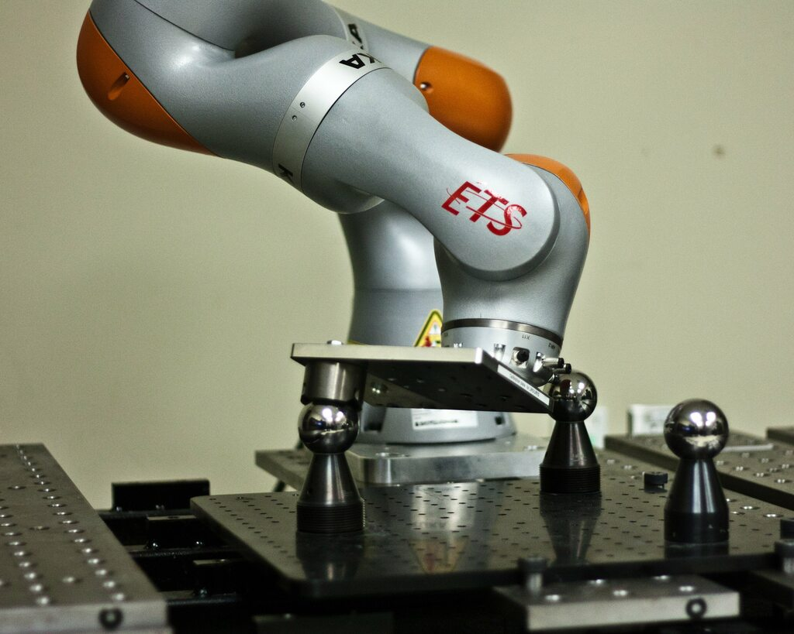

Design that is backed by data proves that your work is on the right track.
It reveals the pain points, flaws, and opportunities, while unearthing new trends and improves your designs by adding objectivity.

Data collection, processing, and analysis are fundamental skills that engineers need to create effective solutions and data-driven designs.
A big reason for this [Python for Hardware Engineers]() series is because I believe that the standard educational pathways that hardware engineers follow isn't sufficient for modern data-driven practices.

In university, mechanical and electrical engineering lab sessions required us to collect maybe few dozen data points and produce a report.
Even our [semi-realistic temperature and humidity data processing example using a real data logger]() only collected recordings at 30min intervals.
This would only produce a few hundred recordings during a week of constant data collection, something which Excel or simple `pandas` scripts can easily handle.

But what happens when we collect more data?
At what point does data get "big" for a hardware engineer?
When do I need a fancy database?

Well, I'll let you in on a little secret: 95% of the time, recording data to disk is perfectly fine for what we do.
It's just that last 5% of the time where we wished we had used a database...

## Saving Data to Disk

There's nothing I love more than setting up an experiment, clicking go, and watching my PC monitor the progress.
For example, when I developed a [closed-loop robot calibration technique](), I sat back and watched my collaborative robot dance around for a while as my laptop recorded each robot pose and laser tracker measure.
All this data was recorded straight to my hard drive.



How much data was collected to successfully calibrate a robot's absolute accuracy?
Just 1875 measures. That's it. No need for a database here.
As a matter of fact, I designed the recording function to dump each measure straight to disk as a JSON file, such that nothing was kept in memory for too long, just in case an error occurred (read: robot collision).

So here I present the most important data collection functions for a hardware engineer:


```python
import datetime
import json
from pathlib import Path

# these gloabls would preferably be in a config file
# i recommend looking into https://www.dynaconf.com/
DATA_DIR = Path() / "output"
DATA_DIR.mkdir(exist_ok=True)


def record_data() -> dict:
    """Fetch the (fake) data and return it as a Python dict"""
    data = {}
    # get data from somewhere, e.g.:
    data["temperature"] = 23  # degC
    data["humidity"] = 60  # % RH
    return data


def save_data(data: dict, dir_path: Path) -> None:
    """Save the data to an output folder"""
    # datetime strings make for great pseudo-unique,
    # sequential filename prefixes
    now = datetime.datetime.now().strftime("%Y-%m-%d_%H-%M-%S_%f")

    # dump the dict->json data to disk
    # this can easily be done async or in a separate thread
    path = dir_path / f"{now}_recording.json"
    with open(path, "w") as f:
        json.dump(data, f)


# the following functions would be
# inside your "data collection" loop:

# 1) get data
d = record_data()

# 2) dump to disk
save_data(d, DATA_DIR)
```

The above functions will serve you perfectly well up to a few thousand recordings.
As such, my general philosophy for when to save data straight to disk:

- When I have unstructured data in reasonable amounts that the file system can handle
- When I don't want or can't deal with the overhead a database will add

## When Data Gets Too Big

At [AON3D](https://www.aon3d.com/) we have an internal fleet of printers used for customer success, engineering, R&D, and sales.
As an experiment and side-project, I started recording all our prototype printers' temperatures (two toolhead sensors, one chamber sensor, and one bed sensor) over time to have a better understanding of system reliability and "hot-time" during engineering development and testing.

Each printer reports its temperature at a rate of 1Hz.
I record 2s of data, per printer, every 5min to have a high-level overview of our internal fleet.
Each week I produce over 40K recordings totaling several hundred megabytes of data.

Initially, I was lazy and dumped the data to disk using the method described above.
Each week I ran a script that consolidates the data to a CSV, such that other stakeholders can have easy access and weekly reports.
The consolidation process took several minutes as each JSON file is loaded into memory, parsed into a `pandas` Series, concatenated into a DataFrame, and then exported.

This is when data starts to get too big for saving to disk.

## Meet SQLite and `peewee`

SQLite is a relational database system contained in a small C library.
In contrast to many other databases, SQLite is not a client–server engine, but rather it is embedded into the end program.

In Python, SQLite is a library that provides a lightweight disk-based database that doesn’t require a separate server process.
It's the next step after dumping to disk and allows for future growth as you can one day port the code to a larger database, like PostgreSQL.
As a super basic overview of SQL:

- A database can have multiple tables (think Excel workbook having multiple sheets/tabs)
- Each table stores a set of data in rows and columns
- Each column is a data field and has a specific type (e.g., `int`, `float`, `str`, `datetime`, `bool`)
- Each row is an instance of data across all columns (i.e., a recording)

Fortunately, SQLite is built-in to Python, but using it directly is not necessarily too intuitive or "Pythonic".
As a solution, I recommend [`peewee`](https://github.com/coleifer/peewee/), a simple and small [object-relational-mapping (ORM)](https://en.wikipedia.org/wiki/Object%E2%80%93relational_mapping).
It has few expressive concepts to make it easy to learn and intuitive to use as a "Pythonic" wrapper around SQLite:

|`peewee` Object|Corresponds to…|
|---|---|
|Model class|Database table|
|Field instance|Column on a table|
|Model instance|Row in a database table|

Let's create some fake data (based off the previous example) and take a look:


```python
import datetime

from peewee import DateTimeField, FloatField, Model, SqliteDatabase

# we're using `:memory:` for this example,
# but you can use a filename (e.g., `my-database.db`)
# if you want to save the database to disk
db = SqliteDatabase(":memory:")


class BaseModel(Model):
    """Base class that we can share across various data models"""

    class Meta:
        database = db


class Recording(BaseModel):
    """Fake data model for temperature/humidity measurement"""

    # datetime of recording
    # the `default` argument will auto-fill this field for us!
    timestamp = DateTimeField(default=datetime.datetime.now)

    # standard numeric data fields
    temperature = FloatField()
    humidity = FloatField()


# test the database connection
db.connect()

# create the db tables
db.create_tables([Recording])
```


```python
# create a recording instance, i.e., a data row
recording = Recording.create(temperature=25, humidity=60)

# we can use the model instance like an object
print(f"Temp: {recording.temperature}")
print(f"RH: {recording.humidity}")
```

    Temp: 25
    RH: 60


```python
# or create data from a good-old dict
d = {"temperature": 30, "humidity": 80}
recording = Recording.create(**d)
```

Going back to Python objects is also quite easy:


```python
# import included helper functions
from playhouse.shortcuts import model_to_dict

# convert a row/instance back to dict!
model_to_dict(recording)
```


    {'id': 2,
     'timestamp': datetime.datetime(2020, 11, 16, 20, 57, 50, 16240),
     'temperature': 30,
     'humidity': 80}


```python
# convert the whole table back to dicts
list(Recording.select().dicts())
```


    [{'id': 1,
      'timestamp': datetime.datetime(2020, 11, 16, 20, 57, 49, 986195),
      'temperature': 25.0,
      'humidity': 60.0},
     {'id': 2,
      'timestamp': datetime.datetime(2020, 11, 16, 20, 57, 50, 16240),
      'temperature': 30.0,
      'humidity': 80.0}]


This intuitive back and forth between an SQL database and Python objects also makes it easy to bring in our favourite tools, like `pandas`:


```python
import pandas as pd

# convert the whole SQL table to a pd.DataFrame
pd.DataFrame(Recording.select().dicts())
```


<div>
<style scoped>
    .dataframe tbody tr th:only-of-type {
        vertical-align: middle;
    }

    .dataframe tbody tr th {
        vertical-align: top;
    }

    .dataframe thead th {
        text-align: right;
    }
</style>
<table class="dataframe">
  <thead>
    <tr style="text-align: right;">
      <th></th>
      <th>id</th>
      <th>timestamp</th>
      <th>temperature</th>
      <th>humidity</th>
    </tr>
  </thead>
  <tbody>
    <tr>
      <th>0</th>
      <td>1</td>
      <td>2020-11-16 20:57:49.986195</td>
      <td>25.0</td>
      <td>60.0</td>
    </tr>
    <tr>
      <th>1</th>
      <td>2</td>
      <td>2020-11-16 20:57:50.016240</td>
      <td>30.0</td>
      <td>80.0</td>
    </tr>
  </tbody>
</table>
</div>


```python
# convert a row/record to a pd.Series
pd.Series(model_to_dict(Recording.select().where(Recording.temperature == 30).get()))
```


    id                                      2
    timestamp      2020-11-16 20:57:50.016240
    temperature                            30
    humidity                               80
    dtype: object


## Discussion

So that's the gist of it.
Databases don't have to be too much of a headache, especially when we have access to a disk-based database like SQLite.
It's the next step in an iterative approach to design, especially when jumping straight to cloud/docker/client-server databases doesn't make sense.

Just as in hardware design, the KISS principle should be our focus for data collection and analysis.
Most systems, including our data infrastructure, work best if they are kept simple rather than made complicated.
Simplicity should be a key goal in design, and unnecessary complexity should be avoided.
