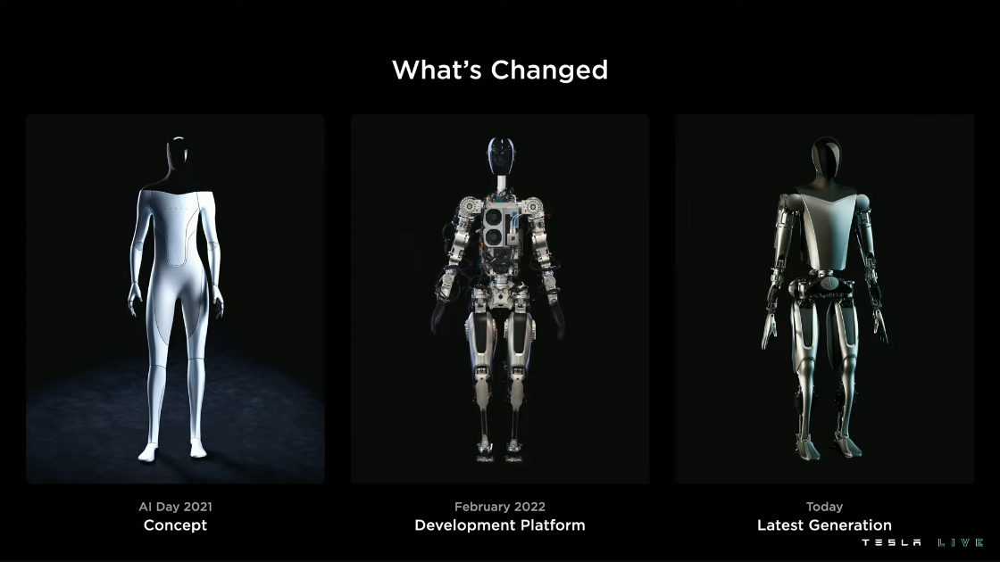
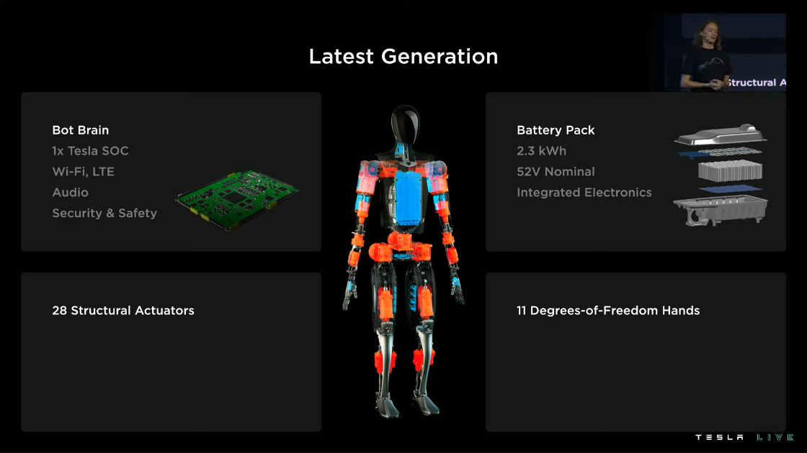
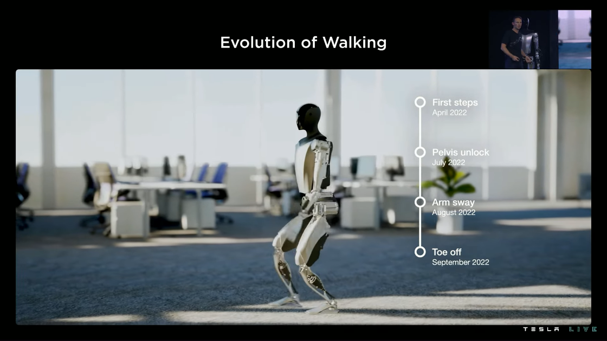
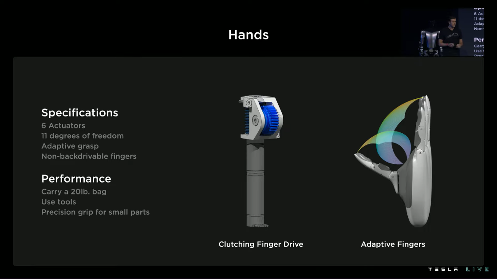
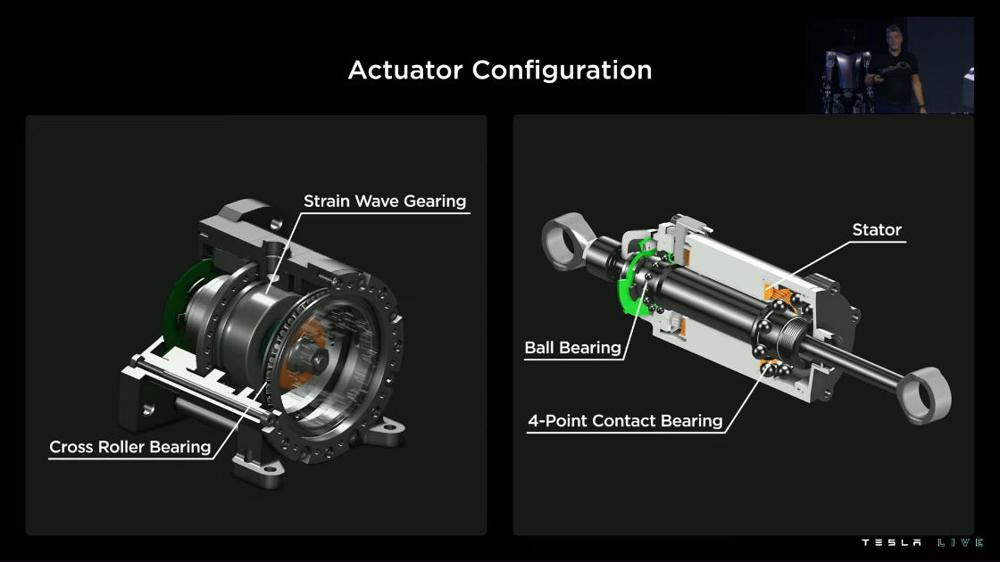
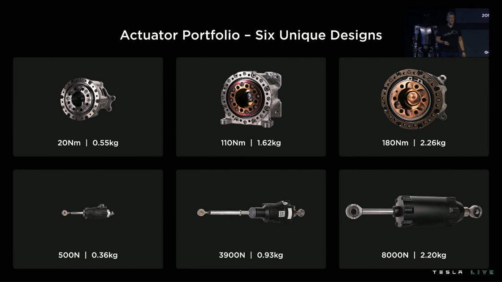

Tesla's AI Day was a significant event in the robotics and AI community.
But, except for recruitment, the intended audience was not roboticists or AI experts; the real audience was the general public and the hype community.

Big tech reveals have partisan commentators that will argue back and forth about the merits of the technology.
It was timely that Tesla AI Day coincided with the [text message dump from the Twitter v. Elon debacle](https://time.com/6218578/elon-musk-texts-twitter/) because if we ask the question, ***what did you get done this week***, well, in the case of Tesla, quite a bit.

There has already been a flood of articles and thought pieces about the bot, [some salty and pessimistic](https://spectrum.ieee.org/robotics-experts-tesla-bot-optimus), [others pure hype](https://ca.finance.yahoo.com/news/tesla-optimus-robot-change-world-182110412.html).
Now, I want to take a more nuanced look at the event and the robot.



## The Event

Let's start with the elephant in the room: they promised a humanoid robot last year and revealed a *working* robot at the event.
The prototype worked well enough for a demo, and the hype continues.



### Hype

There's no denying that Tesla AI Day is more than just a tech event; it's mainly a hype event for marketing and recruitment.

On the financial marketing side, Elon has impeccable timing, hosting the uplifting event just before [poor Q3 results and other negative news](https://electrek.co/2022/10/04/tesla-tsla-plunges-elon-musk-agrees-buy-twitter/).

From a recruitment perspective, it's an incredible opportunity to showcase the team, foster [FOMO](https://en.wikipedia.org/wiki/Fear_of_missing_out), and build in public.
The team deserves kudos for their accomplishments and the velocity they executed.

Beyond recruitment and marketing, the event targets an audience that helps maintain the hype, [generates over $10B in revenue through Model 3 pre-orders](https://www.theguardian.com/technology/2016/apr/04/tesla-motors-sells-10bn-model-3-two-days), and pumps the stock such that it has a P/E ratio of 10x Toyota.
As seen on social media, this audience **loved** the event:



### Velocity

Near the 60-minute mark, the presenter mentions that everything seen here with the robot was only 6-8 months of work, which is incredible.
The sheer velocity and agility of the development team deserve the utmost respect.
(It also helps that cost wasn't an issue.)

---

<iframe src="https://www.linkedin.com/embed/feed/update/urn:li:share:6982076559851483136" allowfullscreen="" title="Embedded post" width="504" height="559" frameborder="0"></iframe>

---

### Show and Tell

Beyond the team's sheer engineering will, I appreciate how the engineers present their work.
A great example is [Felix Sygulla](https://www.linkedin.com/in/felix-sygulla/) explaining how the robot walks at the 50-minute mark.
This kind of *show and tell* empowers teams to stand by their work, explain it to the masses, and understand the mission-to-metrics relationship.
In other words:

> If you can't explain it simply, you don't understand it well enough.
>
> ~ Albert Einstein

## The Robot

From a design and systems architecture point of view, the first development prototype resembles the systems and technology developed by [Apptronik](https://apptronik.com/our-work/).

It is a straightforward humanoid robot design that uses position control with force-torque sensors.
The primary goal of this prototype appears to be to get something moving as quickly as possible.
Robustness and reliability also received a lot of attention, which I appreciate, as this will be an essential element of making real-world applications successful.
This prototype was not designed for dynamic and smooth motions, as we see with other robot designs, such as Boston Dynamic's Atlas.

My biggest concern is that there doesn't seem to be any regard for intrinsic safety.
Stiff joints, high-ratio gears, and a heavy body make for significant moving mass and inertia that a risk assessment will consider.

Alternatively, this was all designed in just a few months, and the team appears to be working very efficiently and can iterate without concern for costs.
Regarding engineering priorities, the team focused on **fast**, then **good**, and has the benefit of not worrying about **cheap**.

### Development Philosophy

As noted by Elon at the 2.5h mark, the development philosophy is to target the "fastest path to a useful robot that can be made at volume."
This reflects the quote by Reid Hoffman:

> If you are not embarrassed by the first version of your product, you've launched too late.
>
> ~ Reid Hoffman

For further context, in a recent interview between [Lex Fridman and Andrej Karpathy](https://www.youtube.com/watch?v=cdiD-9MMpb0), Andrej noted:

> The world is designed for humanoid form factor these things would be able to operate our machines they would be able to sit down in chairs and potentially even drive cars basically the world is designed for humans that's the form factor you want to invest into and make work over time.
>
> [...]
>
> There's a ton of copy paste from what's happening in the autopilot, a lot.
>
> [...]
>
> The amount of expertise that like came out of the woodwork at Tesla for building the human robot was incredible to see like basically Elon said at one point, we're doing this. And then next day, basically like all these CAD models started to appear and people talking about like the supply chain and manufacturing and people showed up with like screwdrivers and everything like the other day and started to like put together the body and I was like, whoa!
>
> [...]
>
> Like all these people exist at Tesla and fundamentally building a car is actually not that different from building a robot the same. And that is true, not just for the hardware pieces and also, let's not forget hardware, not just for a demo, but um, manufacturing of that hardware at scale.
>
> [...]
>
> So if you were to, if you were to go with the goal of like, okay, let's build a million human robots and you're not Tesla, that's that's a lot to ask if your Tesla, it's actually like, it's not, it's not that crazy.

Let's keep this all in mind as we dive into the details.

### Product Market Fit

Per [Goldman Sachs Research](https://www.goldmansachs.com/insights/pages/humanoid-robots.html), it is estimated that humanoid robots are a $6B+ market and are achievable in the next 10 to 15 years.
This is close to the global EV market and one-third of the worldwide smartphone market.
This technology would be able to fill 4% of the projected US manufacturing labour shortage by 2030 and 2% of global elderly care demand by 2035.

In a more ambitious projection, Goldman Sachs Research envisions a market of up to $154B by 2035 if multiple technical breakthroughs are achieved, including:

- A 20h battery life
- Improved mobility and agility
- Improved computation, navigation, and real-world interaction
- A well-defined process for training and refining task abilities
- An ROI of two to three years

A market that size could fill from 48% to 126% of the labour gap.

If we look at the [US Bureau of Labor Statistics for *Hand Laborers and Material Movers*](https://www.bls.gov/ooh/transportation-and-material-moving/hand-laborers-and-material-movers.htm), there were around 6.5M jobs in 2021, growing at a rate of 6% per year, with an average salary of about $30k.
Even with just one robot for every hundred humans, this would be a billion-dollar market opportunity in the U.S. alone.
Comparatively, there are [only around 3.5M industrial robots in the world](https://www.automation.com/en-us/articles/october-2022/ifr-presents-world-robotics-report-2022).

As remarked by [IEEE Spectrum](https://spectrum.ieee.org/tesla-optimus-robot), "Tesla is potentially its biggest customer."
Having an in-house customer (i.e., themselves) will dramatically accelerate the development of the product.

### Batteries

Batteries are one of the most critical components of a mobile robot and probably the system where Tesla has the most significant advantage.
At first glance, the battery pack looks almost swappable, like the Boston Dynamics Spot robot.
This would conceivably allow the robot to have a better duty cycle and uptime by being able to hot-swap the battery for a fresh one instead of waiting for the whole system to charge.

Otherwise, the battery pack is impressively packed with all the electronics and sensing integrated into a single system.
If they're using existing technologies and designs from their vehicles division, then this will be very efficient in terms of development and manufacturing.

### The Gait

As [experts have noted](https://twitter.com/chubicki/status/1576087846405828608), the demonstrated gait looks a little shaky in the prototype, most likely due to the design using planetary rollers with force sensors, making the motion jerky and unnatural.

{}
**Roller Screw**



A roller screw, also known as a planetary roller screw or satellite roller screw, is a low-friction precision screw-type actuator, a mechanical device for converting rotational motion to linear motion or vice versa.

Due to its complexity, the roller screw is a relatively expensive actuator (as much as an order of magnitude more expensive than ball screws) but may be suitable for high-precision, high-speed, heavy-load, long-life, and heavy-use applications.
{}

The controls stack and walking behaviour appear similar to the ASIMO robot, presented in the early 2000s, so nothing novel.
This is [Zero Moment Point (ZMP) locomotion](https://en.wikipedia.org/wiki/Zero_moment_point) with the addition of toe-off.

{}
**Zero moment point (ZMP)**

ZMP is a concept related to the dynamics and control of legged locomotion (e.g., for humanoid robots).

It specifies the point for which dynamic reaction force at the contact of the foot with the ground does not produce any moment in the horizontal direction (i.e., the point where the sum of horizontal inertia and gravity forces is zero).

Most importantly, the concept assumes the contact area is planar and has sufficiently high friction to keep the feet from sliding.
{}

#### Toe-off

According to the presentation, the team achieved toe-off only five months after the first steps.
This is very impressive for a company that has never built a robot.

{}
**Toe-off**

*Toe-off*, visualized in the image below, is an activity in natural human walking and has been linked to minimizing energy loss during impacts on contact.[^toe]

[^toe]: Kuo, Arthur D., J. Maxwell Donelan, and Andy Ruina. "Energetic consequences of walking like an inverted pendulum: step-to-step transitions." Exercise and sport sciences reviews 33.2 (2005): 88-97.

")
{}

### Balance

One question people I've spoken to have is if the system, as designed, can maintain balance in a fixed position.
As they have (at least?) six degrees of freedom per leg, they can walk fully actuated for a range of joint position and velocity combinations.
But with clutches and the loss of actuation, the stability margin of a fixed position will be minimal.

{}
**Clutch**

A clutch is a mechanical device that engages and disengages power transmission, especially from a drive shaft to a driven shaft.
In the most straightforward application, clutches connect and disconnect two rotating shafts.
In these devices, one shaft is typically attached to an engine or other power unit (the driving member), while the other shaft (the driven member) provides output power for work.

E.g., in a torque-controlled drill, one shaft is driven by a motor, and the other drives a drill chuck.
The clutch connects the two shafts so they may be locked together and spin at the same speed (engaged), locked together but spinning at different speeds (slipping), or unlocked and spinning at different speeds (disengaged).
{}

{}
**Stability Margin**

The *stability margin* is the range of disturbances that the system can handle.
Stability for a biped is defined in terms of whether or not the biped will fall.

As discussed in Pratt and Russ (2006): [^stability]

[^stability]: Pratt, Jerry E., and Russ Tedrake. "Velocity-based stability margins for fast bipedal walking." Fast motions in biomechanics and robotics. Springer, Berlin, Heidelberg, 2006. 299-324.

> An ideal stability margin for a biped would act as a fortune teller. It would tell us when the biped is going to fall down next, what the cause will be, and how it can be prevented. If the biped is not going to fall down, the margin would indicate the closest the biped will be to falling down in the next step or so, at what point during the gait this occurs, and how much extra disturbance it could handle.
{}

The trade-off for a clutch-based system would be to save some energy and reduce the active holding torque at the cost of stability.
This *could* make sense if you calculate that the robot will stand in one place for enough time to justify the design choice.
It would mean that static applications are the design focus, not necessarily *practical, dynamic work*.
This is a short-term design choice to *move faster*, while future iterations will take a more dynamic stability approach.

### Mobility

Aside from clutches and gait, one design choice that stands out is the lack of a *bending* axis in the torso.
This can limit functionality when the hips are kinematically locked (e.g., sitting in a chair) or bending over obstacles above the hip's height.

### Manipulation

The manipulation video segments of the presentation were edited *just right* and too choreographed for my tastes.
It came across as a "puppet show" staged performance with pre-computed trajectories, and there weren't any significant contact forces.
This kind of demo is trivial for any robot system.



Was the system perfectly tuned and overfitted on training data for this video clip?
Or is this manipulation ability generalizable across many tasks?
Nevertheless, it appears that the team is focusing on manipulation tasks that will be useful for Tesla factories first.

However, if the watering can demo is realistic, it's super impressive, as long as it wasn't hundreds of attempts to capture just the correct motion for a video clip.

However, despite the added footage from the robot’s sensors, we have no idea how this was done, whether it was autonomous or not, or how many tries it took to get right.
There’s also a clip of a robot picking up an object and attempting to place it in a bin, but the video cuts right before the placement is successful.
This makes me think that we saw carefully curated best-case scenarios for performance.

It also appears that they've integrated friction pads onto the fingers, reducing the overall clamping force of the fingers while maintaining a secure, non-slip grip on objects.

### Safety

First, the hands are not backdrivable, so while they can maintain a grasp for an extended period, I would be very weary about shaking the robot's hand.
The clamping risk needs to be seriously considered for human-robot interaction.

Second, the knee joint is also a safety hazard.
While this may be efficient and effective from a certain design standpoint, there is a complete lack of intrinsic safety.
Failing gracefully in a clamping situation is difficult to do safely through extrinsic safety design.



{}
**Intrinsic Safety**

Safety through the design of the robot itself, often involving the use of soft bodies or compliant joints.
E.g., with damping and mechanical flexibility being part of the design requirements of robotic manipulators, energy transfer during impact is reduced.[^phd]

**Extrinsic Safety**

Safety through the design of the application or software controls.
E.g., software safety systems often use collision avoidance algorithms or force sensors to detect and attempt to stop hard collisions.[^phd]

[^phd]: Nadeau, Nicholas A. Towards the development of safe, collaborative robotic freehand ultrasound. Diss. École de technologie supérieure, 2019.
{}

We won't even address the pinch points all over the body, as I assume these will be resolved in future revisions.

#### Contact Events

Now let's talk about safety, quasi-static contact, and transient contact.

{}
**Quasi-static Contact**

Contact between an operator and part of a robot system, where the operator's body part can be clamped between a moving piece of a robot system and another fixed or moving part of the robot cell.

**Transient Contact**

Contact between an operator and part of a robot system, where the operator's body part is not clamped and can recoil or retract from the moving part of the robot system.
{}

##### Quasi-static Contact

Per [ISO/TS 15066:2016](https://www.iso.org/standard/62996.html), which specifies safety requirements for collaborative industrial robot systems, the maximum permissible quasi-static contact force (e.g., clamping scenario) for human-robot contact is 220N against the thighs, knees, and lower legs.

The target mass of the Tesla bot is 73kg, which is quite heavy.
This has a weight (i.e., force) of about 716N, well over the quasi-static limits if the robot fully clamps a person.

Don't let the robot pin you to the ground.

##### Transient Contact

Transient contact (e.g., faceplant collision) has a limit of twice the maximum allowed quasi-static contact force.
As the exact mass distribution of the robot is proprietary information, we can conservatively estimate the robot's moving mass as the total mass of the robot, $m_R$, in a worst-case faceplant event.

The contact event is simplified as a two-body system, the effective mass of a given human body region, $m_H$,
For the thighs, knees, and the lower legs region, the effective human mass is 75kg. The reduced mass of the two-body system, $\mu$, may now be calculated as:


$
\mu = \left(\frac{1}{m_H} + \frac{1}{m_R}\right)^{-1} = 37kg
$


A quick free-fall calculation from a 1m height (about half the robot's height) has a final faceplant velocity of about 4.4m/s.
The transferred energy due to an inelastic contact, $E$, event is given by:


$
E = \frac{\mu\nu^2}{2} = 358J
$


where $\nu$ is the relative velocity between the robot and human contact bodies.

From ISO/TS 15066:2016, the maximum allowable transferred energy for the thighs and knees region for an injury-free collision is 1.9J, so we're *way* over the limit.

TL;DR, don't let the robot fall on you.

At least they thought about the robot's safety and damage control from faceplant events, as demonstrated by the FEA simulations.



### Supply Chain and Manufacturing

Over the past few months, I've been having calls with financial and investment professionals who want to learn more about the backend operations of building robots, namely the supply chain and manufacturing challenges.

Tesla has the advantage of already building electric vehicles in large volumes.
Essentially, for the Tesla bot, they'll more or less copy many of the same processes, production techniques, and procurement strategies, allowing them to achieve high volumes and low costs.
As Elon let slip, the robot will be less than $20k if they can produce it in volumes of millions of units.

#### Joint Are Expensive

In robotics, joints are usually the primary cost driver of a system, as motors, gears, and the surrounding electronics are high-value items.
This is especially true if you don't reuse the same joint architecture for all joints.
Ideally, a robot would have the same drivetrain for each joint, allowing you to reduce costs by increasing the number of common components (i.e., volume discount).

For example, the cost of strain wave gearing (e.g., Harmonic Drive) is a well-known issue in robotics, even at higher volumes.
The Harmonic Drive company has a near monopoly on the technology, purely from a quality standpoint, as the patent expired decades ago.
As a rule of thumb, each gearing unit costs around a thousand dollars.
So, the Tesla bot would be expected to have a base cost of around $28k (i.e., one gearing unit per joint).

{}
**Strain Wave Gearing**



Strain wave gearing (also known as harmonic gearing) is a mechanical gear system that uses a flexible spline with external teeth, which is deformed by a rotating elliptical plug to engage with the internal gear teeth of an outer spline.

Strain wave gearing has some advantages over traditional gearing systems such as helical or planetary gears, including:

- no backlash
- compactness and lightweight
- high gear ratios
- reconfigurable ratios within a standard housing
- good resolution and excellent repeatability (linear representation) when repositioning inertial loads
- high torque capability
- coaxial input and output shafts

High gear reduction ratios are possible in a small volume (a ratio from 30:1 up to 320:1 is possible in the same space in which planetary gears typically only produce a 10:1 ratio).
{}

I'm curious how Tesla will escape the strain wave gearing cost trap.
Will they attempt to make their own cheaper units?
Or will they transition to a direct-drive system and skip the costs and mass of gears altogether?

### Motors and Actuation

Given the insight on gearing above, motor and actuation design will be critical to costs and mass.
But we already see some hint of progress.
The development platform uses off-the-shelf actuators, but the latest prototype uses custom actuators instead.



As it stands now with the development platform, their mass and cost targets are ambitious, given all the gearing and clutches that are part of their drivetrain system.
This also produces a stiff system with high gear ratios, mechanical locking, and zero compliance.

Notably, they have both a clutch system and high gear ratios.
Typically, the high gear ratios would have been enough to compensate for gravity and to reduce the holding torque (and thus power consumption).

#### Active Impedance Control

However, given torque sensing at each joint, you can do forms of active impedance control to create a pseudo-compliant system, similar to how the KUKA LBR iiwa collaborative robot works.
This masks the system's inertia by sensing collisions but only works well at low speeds and quasi-static conditions.

At high speeds, the end-to-end inertia of the drivetrain system (i.e., motor, gears, moving mass) would be outside the controllable bandwidth and result in high momentary transient forces.
Even the engineers and Elon avoided a direct answer to bandwidth questions during the Q&A.



#### Drivetrain Development

Regardless of the critiques above, I do not doubt that this is just the team's first iteration (of many).
Given the simulation snippets presented around the 41-minute mark, they will undoubtedly make custom motors and drivetrains, focusing on holistic optimization.



With millions of units being the target, they will have enough volume to justify custom designs.

We can already get a peek into their inner systems:



### Software, Perception, and AI

On the software side, according to [Andrej Karpathy](https://www.youtube.com/watch?v=cdiD-9MMpb0), it appears that they have copy-pasted as much as possible from Tesla vehicles and FSD:

> For the software, basically this robot currently thinks it's a car.
> Some of the earlier demos actually, we're talking about potentially doing them outside in the parking lot because that's where all of the computer vision that was like working out of the box.
>
> [...]
>
> All the operating system, everything just copy paste.
> Computer vision mostly copy paste.
>
> [...]
>
> I mean, you have to retrain the neural nuts, but the approach and everything and data engine and offline trackers.
> And the way we go about the occupancy tracker and so on everything copy paste.
> You just need to retrain your neural nets.
>
> [...]
>
> Then the planning control of course has to change quite a bit, but there's a ton of copy paste from what's happening at Tesla.



#### DataOps

I'm always impressed by the sheer magnitude of data Tesla processes.
Between electric vehicles and robots, the Tesla data team will have access to the largest dataset of indoor and outdoor real-world visual data available, a significant advantage for training systems that need to interact with the human environment.

This will also drive their procedural simulation digital twin of the world that was presented near the two-hour mark.
Autolabelling will only become more powerful.



#### Motion Capture and Learning

At around the 55-minute mark, we see motion capture (using HTC Vive body trackers) being used to record natural motion references to be projected onto the robot.
While this is a great "get it done quick" solution, it's not scalable for imitation learning approaches unless you only want to target a handful of specific applications and tasks (e.g., Tesla factory tasks).

Why wasn't teleoperation used (e.g., using VR headsets) instead of motion capture?
Teleoperation would have allowed for a shadow mode whereby the software stack tries to follow the human expert motions.

#### Navigation

One curiosity I have about copying over the Tesla FSD stack is that while it's great for global navigation tasks, autonomous driving is designed to *avoid* objects in the world.
Robots, especially humanoid robots, are designed to interact with objects in the world.

Will they take a two-step approach to navigation and interaction, where the robot plans coarse navigation as a first step and then switches to a local interaction mode?

## Next Steps

As noted around the 20-minute mark, the robot will be working at the Fremont factory.
This will allow the Tesla team to iterate quickly with direct internal customer feedback and task expertise.

It'll also allow them to hide any mistakes and blemishes internally while only showing the public the best performance.
I expect Tesla to build the demand and production volume internally with less worry around costs, similar to how AWS was an internal resource at Amazon before being spun out.
