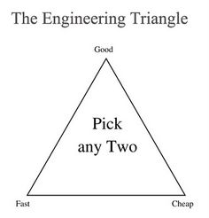

Tesla's AI Day was a big event in the robotics and AI community.
But the intended audience was not roboticists or AI experts, with the exception of recruitment.
The real audience was the general population and the hype community.

While big tech reveals have their partisan commentators that will argue back and forth about the merits of the technology, it was timely that Tesla AI Day coincided with the [text message dump from the Twitter v. Elon debacle](https://time.com/6218578/elon-musk-texts-twitter/), because if we ask the question, ***what did you get done this week?***, well, in the case of Tesla, quite a bit.

There has already been a flood of articles and thoughtpices about the bot, [some salty and negative](https://spectrum.ieee.org/robotics-experts-tesla-bot-optimus), [others pure hype](https://ca.finance.yahoo.com/news/tesla-optimus-robot-change-world-182110412.html).
I myself have been trying to write this article for over a month and my perspectives keep on shifting with each little discussion I have with friends and colleagues.
Now, I want to take a more nuanced look at the event and the robot.



## The Promise

Let's start with the elephant in the room: a humanoid robot was promised last year and a humanoid robot was revealed at this event.
The prototype appeared to work well enough for a demo, and the hype continues.



There's no denying that Tesla AI Day is more than just a tech event; it's mainly a marketing and recruitment event.

On the financial marketing side, it appears that Elon has impeccable timing, hosting the uplifting event just before [poor Q3 results and other negative news](https://electrek.co/2022/10/04/tesla-tsla-plunges-elon-musk-agrees-buy-twitter/).

From a recruitment perspective, its an incredible opportunity to showcase the team, foster FOMO, and build in public.
The team definitely deserves kudos for their accomplishments and the velocity at which they executed.

<iframe src="https://www.linkedin.com/embed/feed/update/urn:li:share:6982076559851483136" allowfullscreen="" title="Embedded post" width="504" height="559" frameborder="0"></iframe>

Near the 60 minute mark, the presenter mentions that everything seen here with the robot was only 6-8 months of work, which is absolutely incredible.
The shear velocity and agility of the development team deserves the upmost respect.
(It also helps that cost wasn't an issue.)

Beyond the sheer engineering will of the team, I really appreciate how the engineers themselves present their work.
A great example is [Felix Sygulla](https://www.linkedin.com/in/felix-sygulla/) explaining how the robot walks at the 50 minute mark.
This kind of demo day show and tell empowers teams to stand by their work, explain it to the masses, and understand the mission-to-metrics relationship.

In the words of Albert Einstein: "If you can't explain it simply, you don't understand it well enough."

Beyond recruitment and marketing, the target audience is the one that helps maintain the hype, [generate over $10B in revenue through Model 3 preorders](https://www.theguardian.com/technology/2016/apr/04/tesla-motors-sells-10bn-model-3-two-days), and pumps the stock such that it has a P/E ratio of 10x Toyota.
As seen on social media, the general public **loved** the event.



## Overall Design

From a design and systems architecture point of view, the first development prototype resembles the systems and technology developed by [Apptronik](https://apptronik.com/our-work/).

It is a simple and straightforward humanoid robot design that uses position control with force-torque sensors.
The primary goal of this prototype appears to be to get something moving as quickly as possible.
Robustness and reliability also received a lot of attention, which I appreciate, as this will be an important element of making real-world applications successful.
This prototype was not designed for dyanmic and smooth motions, like we see with other robot designs, such as Boston Dynamic's Atlas.

My biggest concern is that there doesn't seem to be any regard for instrinsic safety.
Stiff joints, high-ratio gears, and a heavy body makes for a lot of moving mass and inertia that needs to be considered from a risk assessment perspective.

Alternatively, this was all designed in just a few months and the team appears to be working very efficiently and can iterate without concern for costs.
In terms of the engineering triangle, the team have the benefit of focusing on **good** and **fast**, without having to worry about targeting **cheap**.

## Controls, Mobility, and Locomotion

As other experts have noted, that gait looks a little wobbly in the prototype, most likely due to the design using planetary rollers with force sensors which makes the motion jerky and unnatural.
The controls stack and walking behaviour appear to be the similar the ASIMO robot, which was presented back in the early 2000s, so nothing novel was seen here.
This is [Zero Moment Point (ZMP) locomotion](https://en.wikipedia.org/wiki/Zero_moment_point) with the addition of toe off.



{}
**Zero moment point (ZMP)**

ZMP is a concept related with dynamics and control of legged locomotion (e.g., for humanoid robots).
It specifies the point with respect to which dynamic reaction force at the contact of the foot with the ground does not produce any moment in the horizontal direction (i.e., the point where the sum of horizontal inertia and gravity forces is zero).
Most importantly, the concept assumes the contact area is planar and has sufficiently high friction to keep the feet from sliding.
{}

{}
**Toe Off**

*Toe off*, visualized in the image below, is an action is present in natural human walking and has been linked to minimizing the energy loss during impacts on contact.[^toe]

[^toe]: Kuo, Arthur D., J. Maxwell Donelan, and Andy Ruina. "Energetic consequences of walking like an inverted pendulum: step-to-step transitions." Exercise and sport sciences reviews 33.2 (2005): 88-97.

")
{}

On the locomotion side their work does not (yet!) look very impessive to me. Their gait is quite slow and not very dynamic. It is hard to say exactly what kind of control algorithms they are using but it loos like it could be one of the quite dated Zero Moment Point or Capture Point criterias that used to be very popular a while ago. But it does certainly not look cutting edge compared to some recent demonstrations  of bipedal locomotion on Atlas or Cassie for example.

Aslo it has bend knees and impacts very softly

- 37:30 knee joint not back driveable; efficient and effective design, but what about intrinsic safety?


- 49:00 walking sim
  - only 5mo between first steps and toe off
  - Propulsion (or toe off) is the final stage of the stance phase. It begins immediately as the heel lifts off the ground. During propulsion the foot becomes supinated, allowing the structure of the midfoot to brace tightly producing a rigid lever effect.
  - https://www.footbionics.com/Patients/The+Gait+Cycle.html

No straight leg impact

They also seem to use 6 DoF per leg and therefore can walk fully actuated.

@Toni Garcia it is possible to maintain balance and a fixed position if the system is fully actuated for some joint position/velocity combinations. But usually the stability margin (the range of disturbances the system can handle) would be very small there.

Yeah, I meant loss of actuation due to the clutch. So fully locked.

Super curious why they want it.

Agree. Trading off safety and stability to safe some energy here and there just seems like a bad idea.

maybe they just lock some of them for performing manipulation, but also there that would not be ideal I think

That is why I am not sure whether it really makes sense to use a clutch there. I would assume their will be some delay when you want to reactivate a certain joint which is generally not nice for stabilizing the robot. Interesting design choice for sure.

The first that stands out is the lack of a Y-axis in the torso, this will limit the robot's ability to work while sitting on its knees or a chair in addition to leaning over counters that are above hip-y height.

These numbers generally make sense for a humanoid in their size and weight and are comparable to other “classical humanoids” like Honda-Asimo, UBTech-Walker, DLR-Toro, and IIT-Walkman. What stands out is the very high knee/hip torque which is smart when relying on ZMP-style walking (always in balance). It also follows that there is no way they are reaching their original goal of 54kg with these actuators.

The advantage of this system is that the friction reduces the need for active holding torque, and Tesla also claims it wants to use the clutches to reduce power in holding torque. This comes back to the system being built for static, not dynamic, balance and motions. When you lock the joints in your upper body to save power while holding a large mass, you lose controllability. You would normally like to use that large mass to help you balance and to make your gait more efficient. This also comes down to how much the robot will be standing in the corner vs doing work, I’m a bit surprised that they so openly talk about optimizing for not doing work.

## Manipulation

the sequence where the robot grabs the watering can is quite impressive if that's a realistic result (and not just 100 attempts)

28 DoF , not including hands. hands not backdriveable so they can maintain a grasp for extended periods of time. the thumb has more than one DoF it seems. The hand is really strong, they had a standalone hand demo mounted on a stick and it seems to be more or less minituarized in the hand itself, and it is very strong. i was able to pick up a coke can and turn it upside down without any slippage in the grasp.

- non backdriveable fingers

The magic of friction. With high friction pads on the fingers, the force applied by the fingers need to be less than without high friction materials for picking up the same object.

We'll have those pads

Also hard to say how impressed we sould be on the few manipulation tasks they showed. If that translated to a wide range of objects it would be very impressive but it could also be that they ust got them work for these select few controlled tasks by tuning the knobs and datasets. Any opinions on that?

This looks like staged precomputed trajectories without any significant contacts or external wrenches. Which is trivial for any system, so doesn't really tell us anything

 However, despite the added footage from the robot’s sensors, we have no idea how this was actually done—whether it was autonomous or not, or how many tries it took to get right. There’s also a clip of a robot picking up an object and attempting to place it in a bin, but the video cuts right before the placement is successful. This makes me think that we’re seeing carefully curated best-case scenarios for performance.

## Safety

this version looks decent... if they dress it then it would look pretty good (ignoring the nasty pinch points in arms).

weight goal of 73kg... oof

Do graphs of weight vs impact energy

Nothing back drivable. Clamping hazards

as a product designer it shocks me how much other robotics companies just blatantly ignores pinch points

There seem to be no thoughts currently around the large reflected inertia, the mass of the robot (73kg), or pinch-points when it comes to human safety.


safety for just the robot?
- 35:30 FEAs focused on robot damage control; what about human contact?

## Supply Chain, Manufacturing, and Cost

- same production technique as tesla, high volume, low cost
- - less than 20k$ if millions of units
- - 28dof

Price point of 20k USD, do we believe that?

the development platform uses off the shelf actuators, but the latest uses their own (but couldn't balance or hold its own weight yet)

Their price targe is really ambitious, the cost target should be even lower that 20K USD (they might want to earn money 😅 ). I'm not sure they believe in this target, I have my reservations. But they can squeeze the supply chain a lot, and Tesla has so many products at high volume.

Cost of harmonic drives is a well known issue even in high volumes, the patents expired and prices vary from 400$-1.500$ for component sets depending on load capability and quality/backlash.

Planetary rollers are generally more complex and expensive than ball screws as the rollers and screws need to be very precisely ground after hardening to match and mesh nicely with rolling contact. This will clearly drive the cost of the system.

## Motors and Actuation

- actuators similar to powertrain designed for tesla
- - clutches made to remove need to keep motors on; reduce power consumption
- "off the shelf actuators" in current proto demo

- 43:00 roller screws and actuators and clutch; define these things for the reader
  - https://en.wikipedia.org/wiki/Roller_screw
  - https://www.ewellix.com/en/products/ball-and-roller-screws/roller-screws/planetary-roller-screws
  - https://www.moog.com/products/linear-motion/screws/planetary-roller-screws.html
  - https://en.wikipedia.org/wiki/Clutch
  - integrated force and torque sensors
- strain wave gearing and use gif
  - https://en.wikipedia.org/wiki/Strain_wave_gearing
- 44:20 lifting piano



I don't understand motors well, but this seems more complicated than ours right?
Based on the rotation speeds of the different stages in the motor on the left it seemed like it has a really high gear ratio, or am I seeing wrong?
and if so, does this mean that it's not soft like ours?

Yes, high gear ration with mechanical locking, weather it's a clutch for the rotary or (maybe, not sure) self locking wedge effect for the ball screw.

0 compliance

Very interesting that they added a clutch and high gear ratio since with high gear ratio the holding torque required to e.g. compensate gravity while standing should be much lower than with a low gear ratio motor 🤔

I assume it's for holding weights in the upper body, basically arms

It makes "sense" from a power efficiency standpoint in the hips/torso when carrying objects but requires classical stable gaits

how will these respond when you bump the robot? I guess it's stiff and not softly moving with the motions?

If they do this, then yes. The apptronik system the started with is semi-compliant through series elastic

chatted with some of their hand / motor people. the new prototype doesn't have any wires, so it's hard to know what the wiring layout looks like

their motor housings are heavy but i was told that the motor housing doubles as structural support for the whole robot

We do that as well. Our advantage is that they need a lot of steel for the gearing, and that is very heavy. We don't :)

The hardware stack is overall very traditional, the fact that actuators passively locks makes the robot inheritely unsafe and not backdrivable, but they can maintain position without power consumption (caveat: you cannot mantain position and balance, @michael agree?)

This is a modern HarmonicDrive variable impedance actuator, originally pioneered by DLR in the DLR-Arm (2003) and later Toro robots. This was commercialized through the Kuka LWR series robots and formed the basis for the Franka Panda, which was made by a breakout group from Kuka. Honorable mentions that also did a lot of work in this space is IIT (Walkman). The novel part here is the contact-less torque sensor, torque sensors have traditionally been the reliability problem for these drives and also suffer from drift over time. But even if they solved that problem the inherent actuator dynamics has the same problems.

SHOW GIFS OF MY PHD

Generally, high positioning accuracy requires high stiffness at the price of high robot mass relative to its payload. In contrast, the robotic systems developed at DLR (arms, hands, a humanoid manipulator) are designed for interaction with humans in unstructured, everyday environments. In such applications, high absolute positioning accuracy cannot be exploited due to limited accuracy of position information about the surrounding environment, while its side-effects in design (high stiffness and mass) are clearly undesired. However, the robots are operated at relatively low velocities compared to industrial robots, thus enabling higher gear ratios. The main requirements for the electronic design result from the high number of sensors, such as joint torque sensors, redundant position sensing, and wrist force-torque sensing.

The basic concept here is you can get away with masking your inertia by using your torque sensor and motor to detect collision forces and control them as long as you move slowly. Inner loop joint torque controllers are used to reduce the negative effects of high motor inertia and friction due to the gears. The system is still stiff enough to do high-speed movements in non-collision states, but cannot do high-speed collisions as that is outside of the controllable bandwidth. StrainWave gearing has large hysteresis and friction in addition to sinusoidal torque ripple, requiring high reliance/gains on the torque sensor, adding phase delays and further decreasing bandwidth. When asked about the bandwidth, the engineer did not want to answer, and Elon claimed bandwidth of more like 10-20Hz than 1 Hz, which would be normal for this type of system in low load conditions (bandwidth drops exponentially with load). This is the same system as used in the Honda Asimo and UBTech Walker. The mention of contactless torque sensors is interesting as drift and reliability issues have generally plagued torque sensors in these systems.

If your gear is 20% efficient, you need to provide 5x the torque at your motor, and motor losses follow torque squared, further driving inefficiencies. They also use cross-roller bearings, which, while being very stiff, have significant friction. This will reduce the efficiency even further. I would be very surprised if they manage anything above 20-50% system efficiency on these actuators.

A planetary roller screw has rollers on the nut side, as shown in Figure 2, or on the shaft side, as shown in Figure 3. The threaded rollers are placed between a shaft (inner screw) and a nut (outer screw), providing more contact points than balls. Ball screws are primarily suitable for drive mechanisms that give priority to efficiency and transparency, whereas planetary roller screws are suitable when high load capacity, long service life, and high speed are required. Tesla is here choosing to sacrifice dynamic performance and efficiency for impact proofing and reliability. The torque transparency and compliance of roller screws are very similar to StrainWave gears as described in the previous chapter, although slightly better as they are a function of efficiency. The potential for jamming rollers creates very large ripples on torque.

- 41:00 simulation
  - this is why tesla will make their own motors; focused on holistic optimization for their applications; they will have enough volume to justify


custom motor design and packaging to optimize overall robot design

some of the best looks of the inner system
vertical design of magnetics, gear train with packaging
understands level of integration from all systems
the bot we've seen so far is just a prototype optimized for "getting something moving asap", i have no doubt that there will be many iterations, each of which will coverge towards a more optimal form and function.

## Software, Perception, and AI

the software story seems less mature, they seem to be making a lot of similar high level design choices as FSD = perception + planning. their choice to do mocap retargeting is kind of interesting, curious why they didn't just do teleop

They are good at talking😄. My impression is that the hardware is very immature and underwhelming. The software seemed really good

We can also see that they went for a static neck relying on the cameras to cover the FOV. This will obviously limit HRI, but also cause some occlusion problems as the cameras should translate forward on looking down to increase useful FOV.



- 10k+ GPUs for autolabelling of Tesla vehicle data
  - shared with robot team?
    - big advantage

-   55:30 natural motion references using human demonstration and XR trackers
    - HTC vive body trackers https://www.lifewire.com/set-up-full-body-tracking-on-htc-vive-5216963
    - MOCAP
    - NOT SCALABLE? not true imitation learning

- 47:55 software and navigation
  - cars avoid everything, robots should interact with everything; how do we merge software and navigation autopilot approaches?
  - split problem in two? a global navigation problem then refine to a local interaction problem?
- 48:50 keypoint vslam navigation
  - not end to end visual navigation?

- 1:48:45 procedural simulation using collected ground truth data from autolabelling team



- 19:45 tasks and semantic and manipulation
## Batteries

- battery pack looks like Spot; changeable?
- - everything integrated into battery pack; sensors etc; using vehicle + energy experience and existing techs to make this more efficient to develop, manufacturing, and cooling, and safety
- leverage existing supply chain and manufacturing channels

The fact that they integrated so many electronics in the battery pack, and that they packaged so much energy inside that volume is also impressive. I'm tempted to think that the robot will be heavier than the forty something kg they targeted last year, but I don't have data to back up.

Current weight spec seems to be 73 kg.

I’m guessing the torso cavity they have is significantly larger than ours, which is why they can fit such a large battery pack. Looks like the same form factor cells and a pretty standard configuration, even though the tried to make it sound new and exciting. Integrating electronics like that is standard for all smaller battery packs, but not in EVs.

I wonder if they’re heavy weight offsets the large capacity compared to our smaller capacity and lighter robot

I think I heard they also integrate some level of sensing electronics in there

They also have some buffy fans for the BP

When she says sensing, she’s just describing what every BMS does, sensing the state of the battery pack in terms of voltages, currents, temperatures etc.

The fans might very well not be for the battery, unless they consume way more power than they presented, the pack shouldn’t need it. Perhaps some compute is bolted to it as well?

I’m sure they’re battery will have quite good kWh/kg and kW/kg ratios though

I think battery + PDB might get hot enough?

I assumed there is some compute in the BP when she said sensing

Unless they have what we call compute in there, which would be pretty cool, it should just be a BMS. I think they probably have those fans to cool something other than the battery 😊

@Fredrik Larsen our battery is 400 Wh from memory, is that right. Also curious about their power consumption when they have a 2300Wh battery..

It's a different order of magnitude, so I think we should look into this

I read somewhere they provide "24h service with one charge"

Close, a bit over 500Wh, I agree though, I’m slightly concerned that the input I was given for required capacity might have been too optimistic. The next step up in capacity for us would be around 750Wh.
With our current envelope, there is no space for a larger pack,  but we could potentially make it with a slightly larger back.

I assume Aria will be more power efficient than Optimus, due to different actuators (less friction), and significantly lower weight.

Also, I assume Optimus have some serious on board compute, dissipating quite some power, while Aria has kinda minimal on board compute.

Let's see that. I still remember the day Jesper smiled at me and told me he wants a 200W computer 🫠

## Product Market Fit

 Ignoring that last bit about changing the entire economy, and possibly also ignoring the time frame because “next few months or years” is not particularly meaningful, the push to make Tesla Bot useful is another substantial advantage that Tesla has. Unlike most companies working on humanoid robots, Tesla is potentially its own biggest customer, at least initially, and having these in-house practical tasks for the robot to train on could really help accelerate development.

 BLS material movers and security

## Lex + Andrej Karpathy

I think it is a very good form factor to go after because like I mentioned the the world is designed for humanoid form factor these things would be able to
1:50:18
operate our machines they would be able to sit down in chairs uh potentially even drive cars uh basically the world
1:50:25
is designed for humans that's the form factor you want to invest into and make work over time uh I think you know

 and the reason that happened very quickly is as you alluded to, there's a ton of copy paste from what's happening in the autopilot a lot. The amount of expertise that like came out of the woodworks at Tesla for building the human robot was incredible to see like basically Ellen said at one point, we're doing this. And then next day, basically like all these cad models started to appear and people talking about like the supply chain and manufacturing and people showed up with like screwdrivers and everything like the other day and started to like put together the body and I was like, whoa! Like all these people exist at Tesla and fundamentally building a car is actually not that different from building a robot the same. And that is true, not just for the hardware pieces and also, let's not forget hardware, not just for a demo, but um, manufacturing of that hardware at scale. It's like a whole different thing, but for software as well, basically this robot currently thinks it's a car. Uh, it's gonna

  thinks it's a car. Um, some of the earlier demos actually, we're talking about potentially doing them outside in the parking lot because that's where all of the computer vision that was like working out of the

   of like inside. Um, but all the operating system, everything just copy paste. Computer vision mostly copy paste. I mean, you have to retrain the neural nuts, but the approach and everything and data engine and offline trackers. And the way we go about the occupancy tracker and so on everything copy paste. You just need to retrain your neural lots. Uh, and then the planning control of course has to change quite a bit, but there's a ton of copy paste from what's happening at Tesla. And so if you were to, if you were to go with the goal of like, okay, let's build a million human robots and you're not Tesla, that's that's a lot to ask if your Tesla, it's actually like, it's not, it's not that crazy. And

    I think it's going to take a long time. But the way you want to structure the development is you need to say okay it's going to take a long time. How can I set up the uh product development roadmap so that I'm making revenue along the way. I'm not setting myself up for a 01 loss function where it doesn't work until it works. You don't wanna be in that position. You want to make it useful almost immediately and then you want to slowly deploy it uh and uh

     scale and you want to set up your data engine, your improvement loops, the telemetry, the evaluation, the harness and everything. Um and you want to improve the product over time incrementally and you're making revenue along the way. That's extremely important because otherwise you cannot build these large undertakings just like don't make sense economically. And also from the point of view of the team working on it, they need the dopamine along the way. They're not just going to make a promise about this being useful. This is going to change the world in 10 years when it works, it's not where you want to be, you want to be in a place like I think about a politics today where it's offering increased safety and um and uh convenience of driving today, people pay for it, people like it, people purchase it and then you also have the greater mission that you're working towards

## The Markets

https://www.cnbc.com/2022/11/02/goldman-predicts-humanoid-robots-will-be-a-6-billion-market-in-10-years.html

according to Goldman Sachs

The firm estimates that in 10 to 15 years, it’s achievable for the humanoid robots market to reach $6 billion and continue to grow from there.

it could represent 4% of the U.S. manufacturing labor shortage gap by 2030 and 2% of lack of global elderly care workers by 2035

“Should the hurdles of product design, use case, technology, affordability and wide public acceptance be completely overcome, we envision a market of up to US$154bn by 2035E in a blue-sky scenario (close to that of the global EV market and one-third the global smartphone market as of 2021), which suggests labor shortage issues such as for manufacturing and elderly care can be solved to a large extent,”

“Assuming the technology level will be attained and referencing cost reductions in EV manufacturing historically, our assessment suggests factory applications could be economically viable in 2025E-28E and consumer applications in 2030E-2035E,”

- 20:25 "working at Fremont factory"
- - What's next: focus on their factories
  - lets them iterate and hide blemishes internally
  - lets them build their own volume before public release, like AWS
  - lets them focus on a narrow scope for navigation and manuipulation to get a useful rbotus robot early rather than a mediocre jack of all trades robot

“In a blue-sky scenario we see a range of 21%-463% in incremental revenue by 2030E vs 2021 actual revenue from existing business for key stocks (Leaderdrive/HDS/Hiwin/THK/Sanhua), while in the base case we see 2%-35%,”

Investors can look to buy stocks such as Aptiv PLC and Magna International to capture this growth, the firm said. “Four primary types of sensors used in ADAS include camera, radar, ultrasonic and lidar. Each sensor has its own advantages and limitations, which is why both humanoid robots and ADAS will employ a combination of them, known as the sensor suite

“What’s unique in humanoid robots’ sensing module is gyroscope/ Inertia Measurement Unit (IMU), to keep the robot’s balance,” said Du. Low-end IMUs are usually found in vehicles, while high-end ones can sense movement in three dimensional spaces and are used in aerospace. This could include companies such as Raytheon Technologies and Honeywell

 “Previous start-ups failed to access the mass market because they couldn’t reduce the cost,” she said. “Future attempts at humanoid robots will need to decide whether they can reduce the usage of hardware components and let software take on the analytical role.”

## Lessons

- for young engineers learning ML frameworks, hint hint, pytorch should be your goto

- "fastest path to a useful robot that can be made at volume" - elon 2:30:00
  - internally at tesla factories
  - very sure that design and architecture will go through several revisions
    - hence getting it tested in the real world asap to get feedback
      - great product development lesson: target good enough; get feedback; iterate
        - don't wait for perfection
        - Reid Hoffman's quote — “If you are not embarrassed by the first version of your product, you've launched too late.” — is a great example of loss of intent.

## Future Work

- social robotics is a future enhancement/problem, not a short term focus
  - actuators and tasks come first

- localized control ROM that can't be updated over the intenet
  - localized stop buttons and controls
  - prevent terminator
- Similar to AWS, Dojo and teslabot will start as internal tools that scale up to the point where public release can subsidize their cost and crreate new revenue streams
- Start with simple tasks, eg loading parts, carry from one end of the factoy, etc
  - BLS material movers
    - even just 1 robot for every 100 humans is 60k robots
      - to put in perspective, there's only around 3.5M industrial robots in the world
        - https://www.automation.com/en-us/articles/october-2022/ifr-presents-world-robotics-report-2022
        - that's just one application of humanoid robots
      - number of useful situations will grow exponentially; start small and focused
- three to five year target is reasonable if scope is focused
