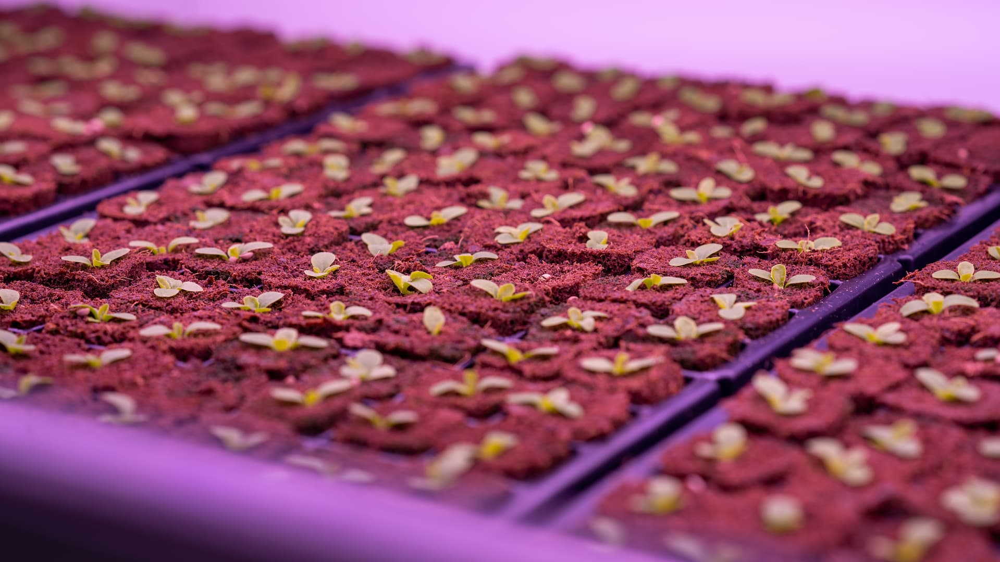
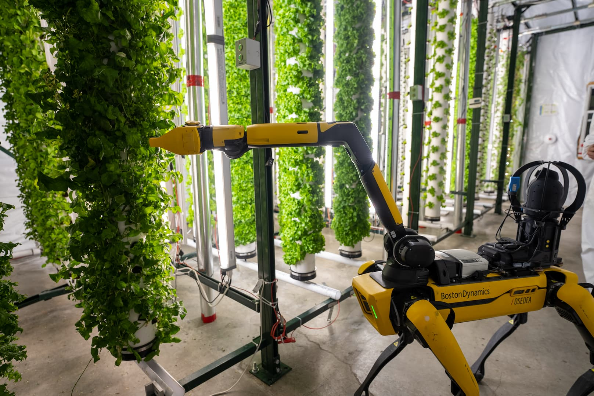
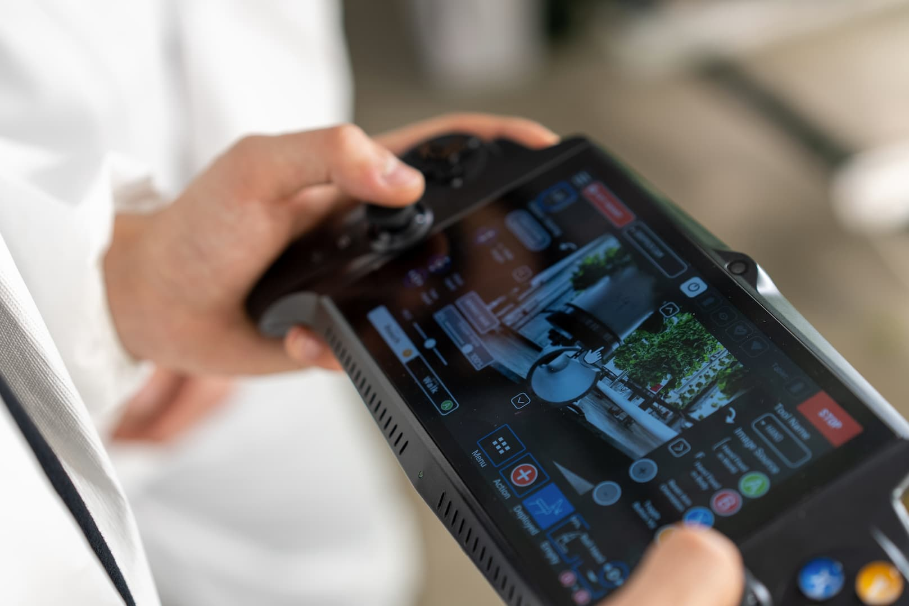
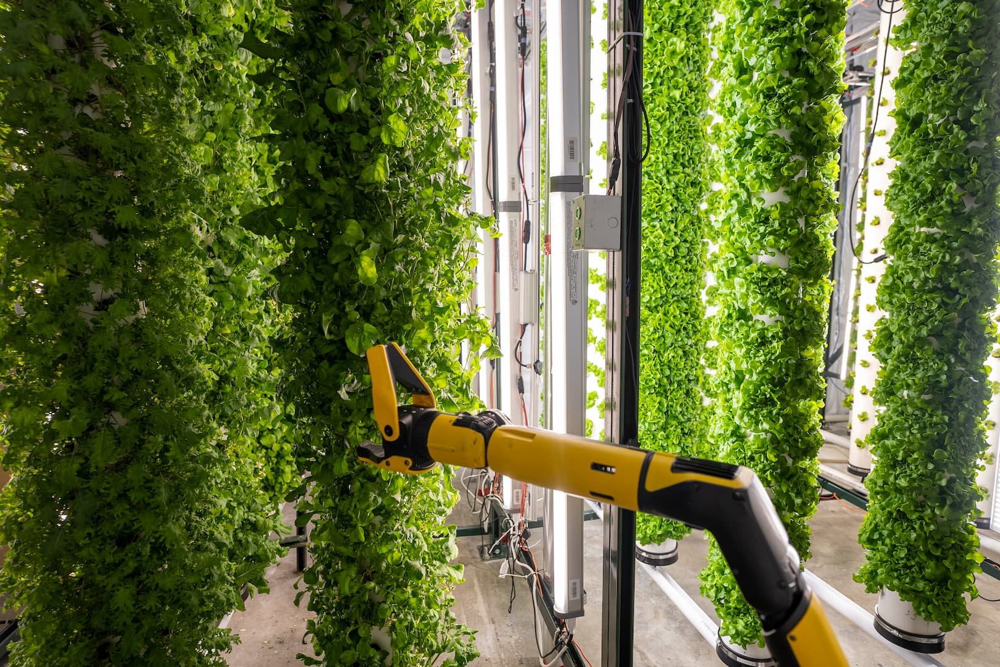
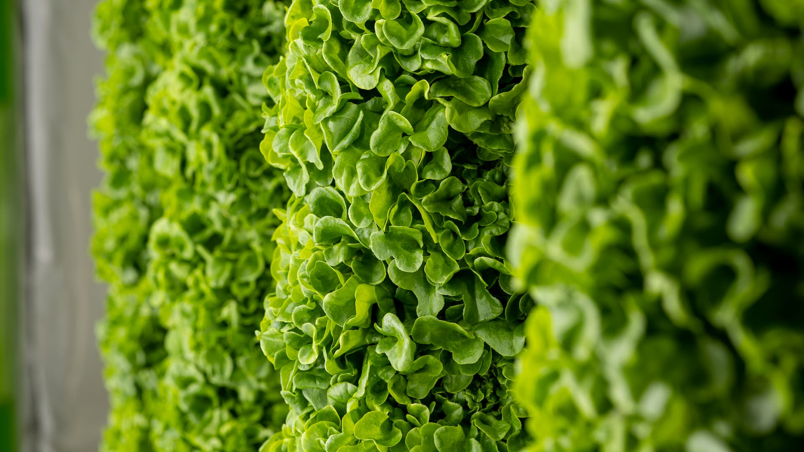

Interius Farms, a pioneer in AgTech innovation, collaborated with [Nadeau Innovations]() and [Osedea](https://www.osedea.com/) to explore the potential of dynamic sensing and mobile robotics in vertical farming. This joint partnership aims to deliver efficiency, automation, and precision to growing leafy greens and herbs, all emphasizing environmental responsibility.



## Robotics and AI in Vertical Farming

Interius Farms is at the forefront of agriculture, using state-of-the-art technology to challenge traditional farming practices. Leveraging Nadeau Innovations' expertise and the Spot robot, they have successfully integrated robotics and AI into their operations. The Spot robot navigates the farm autonomously and facilitates around-the-clock precise tasks, enabling accurate data collection and reducing the need for manual, error-prone practices.

## Creating a Sustainable Future with Hard Tech

Interius Farms' alignment with Nadeau Innovations underscores their mutual commitment to sustainability. By implementing robotics, AI, and data analytics, Interius Farms maximizes efficiency and minimizes resource usage. Through their hydroponic system, they use 95% less water and 92% less land than traditional agriculture. Additionally, the controlled environment and optimized lighting systems reduce energy consumption, making their vertical farm a model of energy efficiency.

## What's Next

The deployment of the Spot robot at Interius Farms, enabled by Nadeau Innovations and Osedea, is a step in revolutionizing vertical farming. Enhanced efficiency, productivity, and sustainability are now achievable through integrating robotics, AI, and tailored software solutions. The collaboration between Interius Farms, Nadeau Innovations, and Osedea exemplifies the strength of partnerships and research-driven innovation.

By adopting hard tech and harnessing the transformative capabilities of robotics and AI, forward-thinking businesses like Interius Farms are building toward a more sustainable future. With vertical farming, AgTech, robotics, and AI, industry leaders become data architects, making informed decisions to optimize their operations.

Interius Farms, Nadeau Innovations, and Osedea are shaping agriculture's future and nurturing a world where innovation and sustainability thrive.

