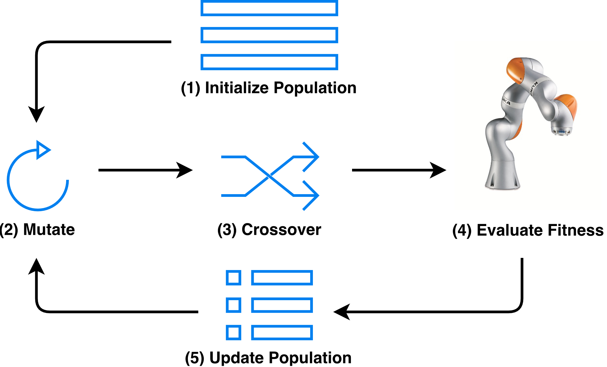

## Design

The  high-level  steps  of  differential  evolution  (DE): (1) A population of candidate solution vectors is initialized;(2)  Mutations  are  generated  for  each  candidate;  (3)  The mutations  are  crossed  with  the  original  candidates;  (4)  The fitness of the crossed candidates is scored; (5) The population is updated based on the scored fitness. Steps 2-5 are repeated until a convergence criterion is met.

## Results

## Presentations

This work has been featured in [Python meetup talks]() and [IEEE webinars]():




